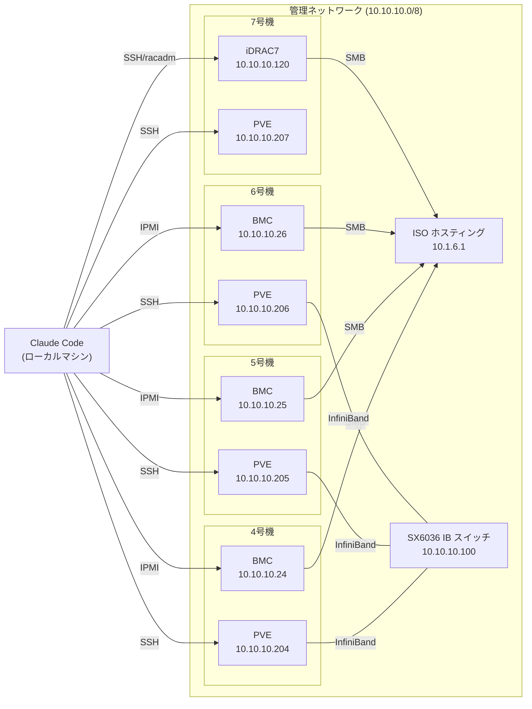

# pvese — Proxmox VE Storage Evaluation

Supermicro IPMI と Proxmox VE を操作して、分散ストレージ (Ceph, GlusterFS 等) の比較評価を行うツールキット。

Claude Code (AI エージェント) がローカルマシンから SSH 経由で物理サーバを操作し、OS インストールからストレージベンチマークまでを自動化する。

## 特徴

- **BMC VirtualMedia による OS 自動インストール** — Redfish API / CGI API / iDRAC racadm で ISO マウント、preseed による無人インストール
- **マルチプラットフォーム BMC 対応** — Supermicro IPMI と Dell iDRAC7 の両方を統一的に操作
- **多段フェーズのオーケストレーション** — ISO ダウンロード → preseed 生成 → ISO リマスタ → BMC マウント → インストール監視 → PVE セットアップまで状態追跡付きで実行
- **排他ロック** — `pve-lock.sh` による flock ベースのロックで、複数の Claude Code セッションが同じクラスタを安全に操作
- **課題管理・レポート追跡** — `issue.sh` による課題管理と、作業完了時のレポート自動生成
- **LINSTOR/DRBD ストレージベンチマーク** — fio による性能計測、ノード障害シミュレーション・復旧
- **InfiniBand (SX6036) ネットワーク評価** — シリアルコンソール経由での Mellanox スイッチ設定・ベンチマーク

## 技術スタック

| カテゴリ | 技術 |
|---------|------|
| メイン言語 | POSIX sh (`#!/bin/sh`, `set -eu`) |
| CLI ツール | Rust (`tools/` Cargo workspace) |
| 補助スクリプト | Python (SOL モニタ, KVM スクリーンショット等) |
| サーバ管理 | Supermicro Redfish API / CGI API, Dell iDRAC racadm, ipmitool |
| 仮想化基盤 | Proxmox VE REST API + CLI (pvesh, qm, pct, pveceph) |
| OS インストール | Debian preseed, ISO リマスタ |
| AI エージェント | Claude Code (`.claude/skills/` によるスキル定義) |

## ディレクトリ構成

```
pvese/
├── scripts/              # 主要スクリプト群
│   ├── bmc-power.sh          # BMC 電源管理 (on/off/reset/status)
│   ├── bmc-session.sh        # BMC CGI セッション管理
│   ├── bmc-virtualmedia.sh   # BMC VirtualMedia マウント/アンマウント
│   ├── bmc-screenshot.sh     # BMC KVM スクリーンショット取得
│   ├── bmc-kvm-screenshot.py # BMC KVM スクリーンショット (Python版)
│   ├── idrac-virtualmedia.sh # iDRAC7 VirtualMedia マウント・ブート操作
│   ├── idrac-kvm-screenshot.py # iDRAC7 KVM スクリーンショット取得
│   ├── generate-preseed.sh   # preseed.cfg 生成
│   ├── remaster-debian-iso.sh # Debian ISO リマスタ (preseed 埋め込み)
│   ├── os-setup-phase.sh     # OS セットアップ フェーズ管理
│   ├── pre-pve-setup.sh      # DHCP ネットワーク・apt ソースの事前設定
│   ├── pve-setup-remote.sh   # PVE リモートセットアップ
│   ├── ssh-wait.sh           # SSH 接続ポーリング待機
│   ├── ib-setup-remote.sh    # InfiniBand リモートセットアップ
│   ├── sol-login.py          # SOL (Serial Over LAN) 自動ログイン
│   ├── sol-monitor.py        # SOL インストール進捗モニタ
│   ├── syslog-receiver.sh    # UDP syslog 受信 (インストーラ診断用)
│   ├── sx6036-console.py     # SX6036 IB スイッチ シリアルコンソール
│   ├── linstor-bench-preflight.sh    # ベンチマーク前チェック (SMART 等)
│   ├── linstor-multiregion-setup.sh  # LINSTOR マルチリージョンセットアップ
│   ├── linstor-multiregion-node.sh   # LINSTOR マルチリージョンノード操作
│   └── linstor-multiregion-status.sh # LINSTOR マルチリージョン状態確認
├── config/               # サーバ・スイッチ設定ファイル (YAML)
│   ├── server4.yml
│   ├── server5.yml
│   ├── server6.yml
│   ├── server7.yml
│   ├── linstor.yml
│   └── switch-sx6036.yml
├── docs/                 # 運用ドキュメント
├── preseed/              # Debian preseed テンプレート・生成ファイル
├── state/                # フェーズ実行状態の永続化
├── issues/               # 課題管理データ (issues.yml)
├── report/               # 作業レポート (Markdown)
├── log/                  # 操作ログ (oplog.log)
├── tools/                # Rust CLI ツール (Cargo workspace)
├── bin/                  # プロジェクトローカルのバイナリ (yq 等)
├── tmp/                  # セッション別一時ファイル
├── .claude/skills/       # Claude Code スキル定義
├── issue.sh              # 課題管理 CLI
├── oplog.sh              # 操作ログ記録
├── pve-lock.sh           # PVE/IPMI 操作の排他ロック
├── CLAUDE.md             # Claude Code へのルール・ガイダンス
├── ISSUE.md              # 課題管理ルール
└── REPORT.md             # レポート作成ルール
```

## 対応済みハードウェア

os-setup 自動化が対応済みのハードウェアプラットフォーム。

### Supermicro X11DPU (4-6号機)

| 項目 | 仕様 |
|------|------|
| シャーシ | SYS-6019U-TN4R4T (1U) |
| マザーボード | X11DPU |
| CPU | 2x Intel Xeon |
| メモリ | 32 GiB |
| ブートデバイス | NVMe SSD (`/dev/nvme0n1`) |
| NIC | 4x 10GBase-T (eno1np0, eno2np1, eno3np2, eno4np3) |
| InfiniBand | ConnectX-3 CX354A (QSFP+, 40 Gbps QDR) |
| BMC | Supermicro IPMI (FW 01.73.06, Redfish v1.8.0) |
| ブートモード | UEFI |
| VirtualMedia | SMB 経由 (CGI API) |
| SOL | COM2 / ttyS1 (`serial_unit: 1`) |

### DELL PowerEdge R320 (7号機)

| 項目 | 仕様 |
|------|------|
| シャーシ | PowerEdge R320 (1U) |
| CPU | Intel Xeon (1-socket) |
| ブートデバイス | PERC H710 Mini RAID (`/dev/sda`, VD0 RAID-1 278 GB) |
| NIC | eno1 (管理), eno2 (DHCP) |
| BMC | iDRAC7 (FW 2.65.65.65) |
| ブートモード | UEFI (Legacy BIOS + GPT は非対応) |
| VirtualMedia | SMB 経由 (racadm remoteimage) |
| SOL | COM1 / ttyS0 (`serial_unit: 0`) |
| 認証 | SSH 鍵認証 (`~/.ssh/idrac_rsa`, RSA 2048) |

### IB スイッチ

| 項目 | 仕様 |
|------|------|
| モデル | Mellanox SX6036 (MSX6036F-1SFS) |
| ポート | 36x QSFP+ FDR InfiniBand |
| FW | MLNX-OS 3.6.8012 |
| 管理 IP | 10.10.10.100 |
| 操作 | シリアルコンソール (`/dev/ttyUSB0`) |

## 環境構成

### サーバ一覧

| サーバ | BMC IP | 静的 IP | ホスト名 | ハードウェア |
|--------|--------|---------|----------|------------|
| 4号機 | `10.10.10.24` | `10.10.10.204` | ayase-web-service-4 | Supermicro X11DPU |
| 5号機 | `10.10.10.25` | `10.10.10.205` | ayase-web-service-5 | Supermicro X11DPU |
| 6号機 | `10.10.10.26` | `10.10.10.206` | ayase-web-service-6 | Supermicro X11DPU |
| 7号機 | `10.10.10.120` (iDRAC) | `10.10.10.207` | ayase-web-service-7 | DELL PowerEdge R320 |

- 4-6号機: Supermicro X11DPU / BMC: IPMI (Redfish + CGI API)
- 7号機: DELL PowerEdge R320 / BMC: iDRAC7 SSH 鍵認証
- OS: Debian 13 (Trixie) + Proxmox VE 9
- PVE クラスタ: pvese-cluster (3ノード)

### ネットワーク構成



## 主要スクリプト

### BMC 操作 (Supermicro)

| スクリプト | 用途 |
|-----------|------|
| `scripts/bmc-power.sh` | 電源管理 (on, off, reset, status, bios-setup) |
| `scripts/bmc-session.sh` | BMC CGI API セッション取得・解放 |
| `scripts/bmc-virtualmedia.sh` | VirtualMedia ISO マウント・アンマウント・状態確認 |
| `scripts/bmc-screenshot.sh` | KVM コンソールのスクリーンショット取得 |

### iDRAC 操作 (DELL)

| スクリプト | 用途 |
|-----------|------|
| `scripts/idrac-virtualmedia.sh` | iDRAC7 VirtualMedia マウント・ブート操作 |
| `scripts/idrac-kvm-screenshot.py` | iDRAC7 KVM スクリーンショット取得 |

### OS セットアップ

| スクリプト | 用途 |
|-----------|------|
| `scripts/generate-preseed.sh` | config YAML から preseed.cfg を生成 |
| `scripts/remaster-debian-iso.sh` | Debian ISO に preseed を埋め込んでリマスタ |
| `scripts/os-setup-phase.sh` | セットアップフェーズの状態管理 (init/start/check/mark/fail/reset/status) |
| `scripts/pre-pve-setup.sh` | DHCP ネットワーク・apt ソースの事前設定 |
| `scripts/pve-setup-remote.sh` | SSH 経由で PVE リポジトリ追加・パッケージインストール |
| `scripts/ssh-wait.sh` | SSH 接続ポーリング待機 |

### モニタリング

| スクリプト | 用途 |
|-----------|------|
| `scripts/sol-login.py` | SOL 経由の自動ログイン・ブートステージ検出 |
| `scripts/sol-monitor.py` | SOL 経由のインストール進捗モニタリング |
| `scripts/bmc-kvm-screenshot.py` | KVM スクリーンショット取得 (Python版、POST コード判定付き) |
| `scripts/syslog-receiver.sh` | UDP syslog 受信 (インストーラ診断用) |

### InfiniBand

| スクリプト | 用途 |
|-----------|------|
| `scripts/ib-setup-remote.sh` | InfiniBand ドライバ・ツールのリモートセットアップ |
| `scripts/sx6036-console.py` | SX6036 スイッチのシリアルコンソール操作 |

### LINSTOR/DRBD

| スクリプト | 用途 |
|-----------|------|
| `scripts/linstor-bench-preflight.sh` | ベンチマーク前チェック (SMART ヘルス等) |
| `scripts/linstor-multiregion-setup.sh` | マルチリージョンセットアップ |
| `scripts/linstor-multiregion-node.sh` | マルチリージョンノード操作 |
| `scripts/linstor-multiregion-status.sh` | マルチリージョン状態確認 |

## ルートスクリプト

### `issue.sh` — 課題管理

```sh
./issue.sh list                    # 未完了課題の一覧
./issue.sh show <id>               # 課題の詳細表示
./issue.sh add "タイトル" --label infra  # 新規課題作成
./issue.sh start <id>              # 課題を active に遷移
./issue.sh done <id>               # 課題を完了
```

### `oplog.sh` — 操作ログ

状態変更を伴う操作をタイムスタンプ・終了コード・実行時間付きで記録する。

```sh
./oplog.sh <command...>            # コマンドを実行しログに記録
```

ログは `log/oplog.log` に蓄積される。

### `pve-lock.sh` — 排他ロック

PVE クラスタや IPMI の状態変更操作を排他制御する。

```sh
./pve-lock.sh status               # ロック状態を確認
./pve-lock.sh run <command...>     # ロック取得して実行 (取得できなければエラー)
./pve-lock.sh wait <command...>    # ロック待ちして実行
```

## OS セットアップフェーズ

OS インストールは以下の 8 フェーズで段階的に実行される:

1. **iso-download** — Debian ISO のダウンロード・SHA256 検証
2. **preseed-generate** — config YAML から preseed.cfg を生成
3. **iso-remaster** — preseed を埋め込んだカスタム ISO を作成
4. **bmc-mount-boot** — BMC VirtualMedia で ISO をマウントし起動
5. **install-monitor** — SOL モニタでインストール進捗を監視
6. **post-install-config** — SSH 経由で初期設定 (ネットワーク, locale 等)
7. **pve-install** — Proxmox VE リポジトリ追加・パッケージインストール
8. **cleanup** — VirtualMedia アンマウント・一時ファイル削除

各フェーズの状態は `state/os-setup/` に永続化され、失敗時の途中再開が可能。

## Claude Code 連携

このプロジェクトは Claude Code (AI エージェント) による操作を前提としている。

- **`.claude/skills/`** — 以下のスキルが定義されており、Claude Code が複雑な手順を自律的に実行できる:
  - `os-setup` — OS セットアップ (Debian + PVE 自動インストール)
  - `ib-switch` — IB スイッチ操作 (SX6036 シリアルコンソール)
  - `linstor-bench` — LINSTOR/DRBD ストレージベンチマーク
  - `linstor-node-ops` — LINSTOR ノード障害シミュレーション・復旧
  - `idrac7` — iDRAC7 基本操作 (racadm SSH)
  - `idrac7-fw-update` — iDRAC7 ファームウェアアップデート
  - `dell-fw-download` — Dell ファームウェアダウンロード (Playwright)
  - `tftp-server` — Docker TFTP サーバ (FW アップデート用)
  - `playwright` — Playwright セットアップ・ブラウザ自動化
- **`CLAUDE.md`** — スクリプト規約、パーミッション設定、操作ルール等を Claude Code に指示
- **`ISSUE.md`** — 課題の状態遷移ルールを定義
- **`REPORT.md`** — レポートのフォーマットを定義

## Claude Code への指示例

Claude Code セッションを開始した後、以下のように話しかけると各操作を実行できる。

### OS セットアップ

4号機に Debian + Proxmox VE を自動インストールする（8フェーズを順次実行）。

```
/os-setup config/server4.yml
```

自然言語での指示例:
- 「4号機に OS をインストールして」
- 「5号機の OS セットアップを Phase 5 から再開して」
- 「4号機のインストール状態を確認して」

### iDRAC7 操作

7号機 (DELL R320) の iDRAC7 経由での操作。

| コマンド | 用途 |
|---------|------|
| `/idrac7 status` | iDRAC7 基本ステータス確認 |
| `/idrac7-fw-update` | iDRAC7 ファームウェアアップデート |
| `/dell-fw-download` | Dell FW バイナリのダウンロード・抽出 |

自然言語での指示例:
- 「7号機の iDRAC ステータスを確認して」
- 「iDRAC7 のファームウェアをアップデートして」
- 「Dell のファームウェアをダウンロードして」

### InfiniBand スイッチ操作

Mellanox SX6036 スイッチの状態確認・設定変更を行う。

| コマンド | 用途 |
|---------|------|
| `/ib-switch status` | バージョン・温度・ファン・ポート状態の一括表示 |
| `/ib-switch ports` | 36 ポートの IB 接続状態を表示 |
| `/ib-switch show <cmd>` | 任意の show コマンドを実行 (例: `show interfaces brief`) |
| `/ib-switch enable-cmd <cmd>` | enable モードでコマンド実行 (例: `show running-config`) |
| `/ib-switch configure <file>` | ファイルから設定を投入 |

自然言語での指示例:
- 「IB スイッチのポート状態を見せて」
- 「IB スイッチの running-config を確認して」
- 「IB スイッチの Subnet Manager の状態を確認して」

### LINSTOR/DRBD ベンチマーク

LINSTOR ストレージ上に VM を作成し、fio ベンチマーク（7テスト）を実行する。

```
/linstor-bench thin
/linstor-bench thick-stripe
```

自然言語での指示例:
- 「thin プロビジョニングでストレージベンチマークを実行して」
- 「thick-stripe と thin の性能を比較したい」
- 「前回のベンチマーク結果をレポートにまとめて」

### LINSTOR ノード操作

ノード障害シミュレーション・復旧・離脱・再参加の実験を行う。

| コマンド | 用途 |
|---------|------|
| `/linstor-node-ops fail server4` | 4号機を強制電源断して障害をシミュレート |
| `/linstor-node-ops recover server4` | 電源投入 + DRBD ビットマップ再同期 |
| `/linstor-node-ops depart server4` | クラスタから正常離脱 (リソース・SP・ノード削除) |
| `/linstor-node-ops rejoin server4` | 離脱ノードをクラスタに再参加 |

自然言語での指示例:
- 「4号機を落として障害時の挙動を確認して」
- 「4号機を復旧して DRBD の再同期を待って」
- 「5号機をクラスタから離脱させて」

### 課題管理・日常操作

```sh
./issue.sh list                    # 未完了課題の一覧
./issue.sh show <id>               # 課題の詳細表示
```

自然言語での指示例:
- 「未完了の課題を一覧して」
- 「課題 #18 の状態を確認して」
- 「"BMC セッションタイムアウト対策" で課題を作成して」
- 「4号機の電源状態を確認して」
- 「PVE クラスタの状態を確認して」
- 「ロックが取れないので別の課題に着手して」

## ライセンス

未定
