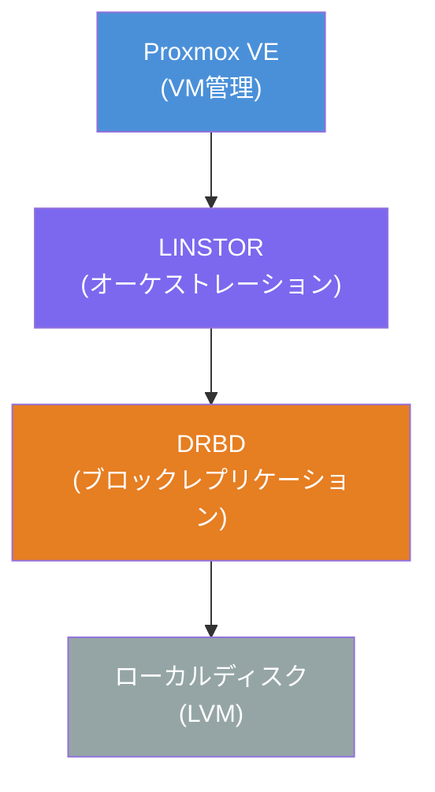
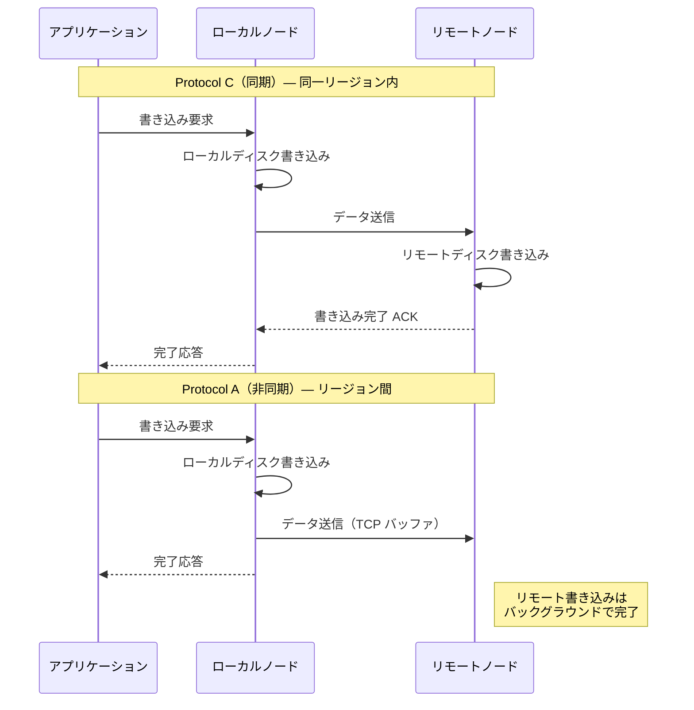
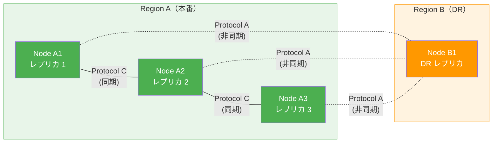
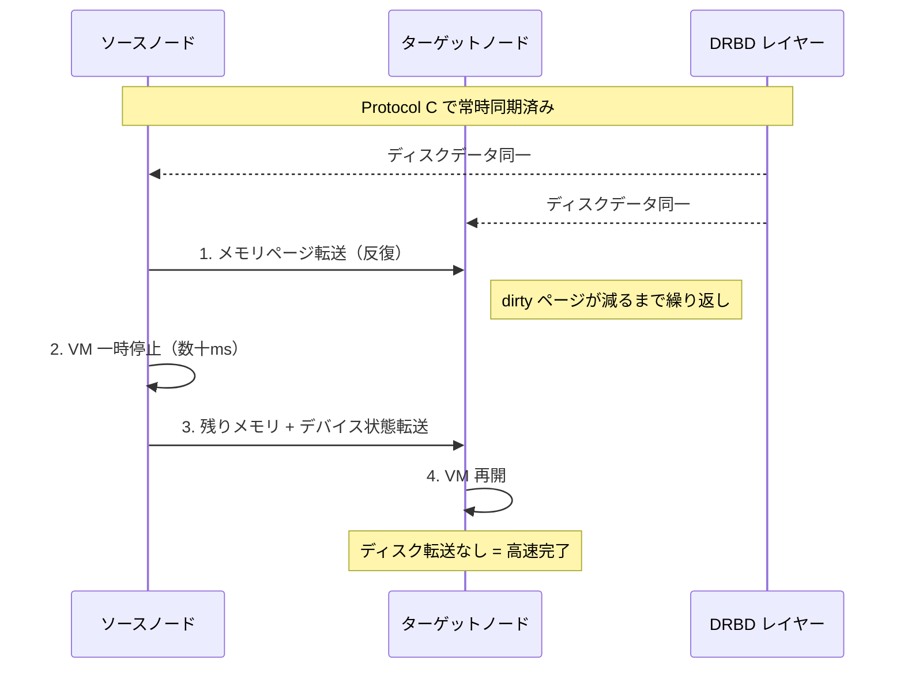
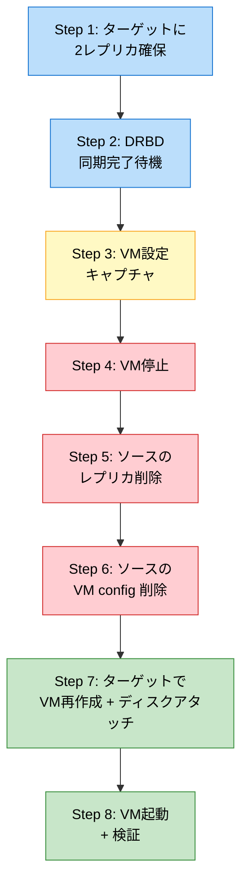
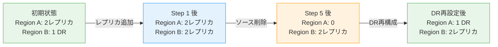
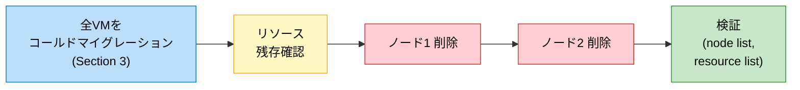
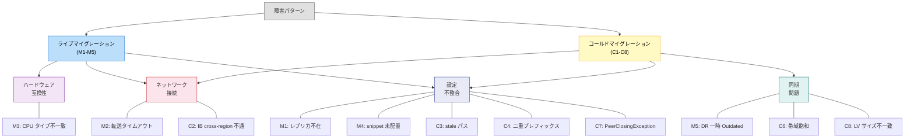

# LINSTOR マルチリージョンマイグレーション チュートリアル

## はじめに

本チュートリアルは、LINSTOR/DRBD マルチリージョン環境での VM マイグレーション操作をステップバイステップで解説する。

### 対象読者

- Proxmox VE + LINSTOR 環境の運用者
- DRBD/LINSTOR をこれから学ぶ管理者（基本概念は本チュートリアル内で解説）

### 前提知識

- PVE の基本操作 (`qm` コマンド)
- SSH 接続と基本的なシェル操作
- DRBD/LINSTOR の経験は不要（次セクションで解説）

### DRBD/LINSTOR とは

**DRBD** (Distributed Replicated Block Device) は、Linux カーネルレベルで動作するブロックデバイスレプリケーション技術。ネットワーク越しの RAID-1 と考えるとわかりやすい。ローカルディスクへの書き込みをリアルタイムでリモートノードに複製し、データの冗長性を確保する。

**LINSTOR** は DRBD のオーケストレーション層。複数ノードにまたがる DRBD リソースの作成・配置・管理を自動化する。PVE と統合することで、VM のストレージとして DRBD ボリュームを透過的に利用できる。



**用語表:**

| 用語 | 説明 |
|------|------|
| **リソース (Resource)** | DRBD で管理されるレプリケーション対象のブロックデバイス。VM のディスクに対応 |
| **レプリカ (Replica)** | リソースの各ノード上のコピー。1 リソースに複数レプリカが存在 |
| **ストレージプール (Storage Pool)** | 各ノード上の物理ストレージ領域 (LVM VG 等) |
| **リソースグループ (Resource Group)** | リソースの配置ポリシーを定義するテンプレート |
| **Controller** | LINSTOR のメタデータ管理ノード。クラスタに 1 台 |
| **Satellite** | Controller の指示で DRBD リソースを管理するワーカーノード |

### Protocol A vs Protocol C

DRBD はレプリケーションの同期レベルを Protocol で制御する:

- **Protocol C (同期)**: リモートノードの書き込み完了まで ACK を返さない。データ損失ゼロを保証。同一リージョン内 (低レイテンシ) で使用
- **Protocol A (非同期)**: ローカル書き込み + TCP 送信バッファへの書き込みで ACK を返す。DR (災害復旧) 向け。リージョン間 (高レイテンシ) で使用



### なぜ 2+1 トポロジーか

本チュートリアルでは **2+1 トポロジー** を採用する:

- **2 レプリカ (同一リージョン, Protocol C)**: 同期レプリケーションでデータ損失ゼロ。両ノードのデータが常に同一のため、VM のライブマイグレーション（ゼロダウンタイム移行）が可能
- **1 DR レプリカ (別リージョン, Protocol A)**: 非同期レプリケーションで災害復旧に備える。リージョン間の高レイテンシでも性能影響を最小化



この設計により:
- **通常運用**: Region A 内でライブマイグレーション可能（メンテナンス時のゼロダウンタイム）
- **DR 発動時**: Region B でコールドマイグレーションにより VM を復旧（VM 停止が必要）
- **性能**: 本番書き込みは Protocol C のみ影響、DR 同期は非同期で性能劣化なし

### 本チュートリアルで扱う操作

1. 環境確認と 2+1 トポロジー構成
2. リージョン内ライブマイグレーション (ゼロダウンタイム)
3. リージョン間コールドマイグレーション (VM 停止必要)
4. リージョン廃止 (全 VM 移行 + ノード削除)
5. リージョン追加 (ノード再登録 + DR レプリカ設定)
6. DR レプリカ構成

### 凡例

- `<VMID>`: VM ID (例: 200)
- `<SOURCE_NODE>`, `<TARGET_NODE>`: LINSTOR ノード名 (例: ayase-web-service-6)
- `<SOURCE_IP>`, `<TARGET_IP>`: ノードの IP アドレス (例: 10.10.10.206)
- `<RESOURCE>`: LINSTOR リソースのベース名 (例: pm-39c4600d)
- `<CONTROLLER_IP>`: LINSTOR コントローラの IP (例: 10.10.10.204)

## 1. 環境準備

### 必要環境

- 6 ノード LINSTOR クラスタ (2 リージョン × 3 ノード)
- `config/linstor.yml` に regions 定義済み
- マルチリージョンスクリプト群が利用可能:
  - `scripts/linstor-multiregion-setup.sh`
  - `scripts/linstor-multiregion-status.sh`
  - `scripts/linstor-multiregion-node.sh`
  - `scripts/linstor-drbd-sync-wait.sh`
  - `scripts/linstor-migrate-live.sh`
  - `scripts/linstor-migrate-cold.sh`

### 初期設定確認

ノードの確認:

```sh
ssh root@<CONTROLLER_IP> "linstor node list"
```

期待出力例:
```
+------------------------------------------------------------+
| Node                  | NodeType   | Addresses             |
|==========================================================|
| ayase-web-service-4   | COMBINED   | 10.10.10.204(PLAIN)   |
| ayase-web-service-5   | SATELLITE  | 10.10.10.205(PLAIN)   |
| ayase-web-service-6   | SATELLITE  | 10.10.10.206(PLAIN)   |
| ayase-web-service-7   | SATELLITE  | 10.10.10.207(PLAIN)   |
| ayase-web-service-8   | SATELLITE  | 10.10.10.208(PLAIN)   |
| ayase-web-service-9   | SATELLITE  | 10.10.10.209(PLAIN)   |
+------------------------------------------------------------+
```

リージョン設定の確認:

```sh
./scripts/linstor-multiregion-status.sh config/linstor.yml
```

### 2+1 トポロジー構成手順

RG の replicas-on-same 設定:

```sh
ssh root@<CONTROLLER_IP> "linstor resource-group modify pve-rg --replicas-on-same site"
ssh root@<CONTROLLER_IP> "linstor resource-group set-property pve-rg Linstor/Drbd/auto-block-size 512"
```

> **注意**: `--replicas-on-same "Aux/site"` ではなく `site` を使う。LINSTOR が自動で `Aux/` プレフィックスを付加する (C4)。

> **`replicas-on-same` とは**: LINSTOR の自動配置制約の一つ。`--replicas-on-same site` と指定すると、リソースの自動配置時に同じ `Aux/site` プロパティ値を持つノードにレプリカを配置する。例えば `Aux/site=region-a` のノードが 2 台あれば、その 2 台にレプリカを配置する。これにより 2+1 トポロジーの「同一リージョン内 2 レプリカ」が実現される。

Aux/site プロパティ + Protocol A 設定:

```sh
./scripts/linstor-multiregion-setup.sh setup config/linstor.yml
```

cross-region パス作成 (PrefNic=ib0 環境の場合):

> **cross-region パスが必要な理由**: LINSTOR に `PrefNic=ib0` を設定している環境では、DRBD 通信はデフォルトで InfiniBand インターフェースを使う。しかし IB ネットワークはリージョン間を跨がないため、リージョン間通信には Ethernet (`default` インターフェース) を強制する必要がある。`node-connection path` でリージョン間ペアに `default` を指定することでこれを実現する。

```sh
# Region A ↔ Region B の全ノードペアにパスを作成
# Region A (3ノード) × Region B (3ノード) = 9ペア
ssh root@<CONTROLLER_IP> "linstor node-connection path create <NODE_A1> <NODE_B1> cross-region default default"
ssh root@<CONTROLLER_IP> "linstor node-connection path create <NODE_A1> <NODE_B2> cross-region default default"
ssh root@<CONTROLLER_IP> "linstor node-connection path create <NODE_A1> <NODE_B3> cross-region default default"
ssh root@<CONTROLLER_IP> "linstor node-connection path create <NODE_A2> <NODE_B1> cross-region default default"
ssh root@<CONTROLLER_IP> "linstor node-connection path create <NODE_A2> <NODE_B2> cross-region default default"
ssh root@<CONTROLLER_IP> "linstor node-connection path create <NODE_A2> <NODE_B3> cross-region default default"
ssh root@<CONTROLLER_IP> "linstor node-connection path create <NODE_A3> <NODE_B1> cross-region default default"
ssh root@<CONTROLLER_IP> "linstor node-connection path create <NODE_A3> <NODE_B2> cross-region default default"
ssh root@<CONTROLLER_IP> "linstor node-connection path create <NODE_A3> <NODE_B3> cross-region default default"
```

DR レプリカ追加:

```sh
ssh root@<CONTROLLER_IP> "linstor resource create <DR_NODE> <RESOURCE>"
./scripts/linstor-multiregion-setup.sh setup config/linstor.yml
./scripts/linstor-drbd-sync-wait.sh <RESOURCE> config/linstor.yml
```

設定確認:

```sh
./scripts/linstor-multiregion-status.sh config/linstor.yml
```

期待出力 (リージョン間が Protocol A になっていること):
```
  <RESOURCE>: <NODE_A1> <-> <NODE_B1> [INTER-REGION]
    protocol=A  allow-two-primaries=false
  <RESOURCE>: <NODE_B1> <-> <NODE_B2> [intra-region]
    protocol=default(C)  allow-two-primaries=default(yes)
```

## 2. リージョン内ライブマイグレーション

Protocol C (同期レプリケーション) により、同一リージョン内の 2 ノードは常に同一のディスクデータを保持している。このため、VM のライブマイグレーションではディスクデータの転送が不要で、メモリ状態とデバイス状態のみを転送すればよい。結果として数十ミリ秒のダウンタイムでマイグレーションが完了する。



### 事前チェックリスト

- [ ] ソースとターゲットが同一リージョン内
- [ ] 両ノードにリソースが UpToDate で存在
- [ ] VM が running
- [ ] CPU タイプが `kvm64` (異種ハードウェア間の場合)

### スクリプトを使った実行

```sh
./pve-lock.sh run ./oplog.sh ./scripts/linstor-migrate-live.sh <VMID> <TARGET_NODE>
```

スクリプトが事前チェック、実行、事後検証を自動で行う。

### 手動実行

事前確認:

```sh
ssh root@<CONTROLLER_IP> "linstor resource list -r <RESOURCE>"
ssh root@<SOURCE_IP> "qm status <VMID>"
```

マイグレーション実行:

```sh
ssh root@<SOURCE_IP> "qm migrate <VMID> <TARGET_NODE> --online"
```

期待出力例:
```
2026-03-09 08:30:00 starting migration of VM 200 to node 'ayase-web-service-7'
...
migration finished successfully (duration 00:00:17)
```

### 事後検証

VM 状態:

```sh
ssh root@<TARGET_IP> "qm status <VMID>"
```
→ `status: running`

VM の uptime (リブートなし確認):

```sh
ssh <VM_USER>@<VM_MGMT_IP> "uptime"
```

データ整合性:

```sh
ssh <VM_USER>@<VM_MGMT_IP> "md5sum -c checksums.txt"
```
→ `OK`

DRBD 状態:

```sh
ssh root@<CONTROLLER_IP> "linstor resource list -r <RESOURCE>"
```

### トラブルシューティング

| 症状 | 障害 ID | 対策 |
|------|---------|------|
| `Failed to set special registers` | M3 | `qm set <VMID> --cpu kvm64` |
| `volume 'local:snippets/...' does not exist` | M4 | 移行先に snippet をコピー |
| タイムアウト | M2 | `--migration_network` を指定 |
| リソース不在エラー | M1 | `linstor resource list` で確認、不足分を作成 |

## 3. リージョン間コールドマイグレーション

リージョン間は Protocol A (非同期) で接続されているため、DR レプリカのデータはソースに対して若干遅延する可能性がある。このためライブマイグレーション（両ノードのデータが常に同一であることが前提）は使えず、VM を停止してからデータの完全同期を確認した上で移行する「コールドマイグレーション」が必要になる。



> 色分け: 青=準備、黄=キャプチャ、赤=破壊的操作、緑=再構築

マイグレーション中のレプリカ配置は以下のように遷移する:



### 事前チェックリスト

- [ ] ソースとターゲットが異なるリージョン
- [ ] ターゲットリージョンに 2 ノードが存在
- [ ] VM の設定情報を控えている (name, memory, cores, MAC, disk size)
- [ ] cross-region パスが作成済み

### スクリプトを使った実行

```sh
./pve-lock.sh run ./oplog.sh ./scripts/linstor-migrate-cold.sh <VMID> <SOURCE_REGION> <TARGET_REGION>
```

スクリプトが Phase 1 (レプリカ準備)、Phase 2 (VM 移行)、Phase 3 (DR 再構成) を自動実行する。

### 手動実行 (8 ステップ)

#### Step 1: ターゲットリージョンに 2 レプリカを確保

```sh
# 現在のレプリカ配置を確認
ssh root@<CONTROLLER_IP> "linstor resource list -r <RESOURCE>"

# DR レプリカが 1 つある場合、もう 1 ノード追加
ssh root@<CONTROLLER_IP> "linstor resource create <TARGET_NODE2> <RESOURCE>"

# cross-region パスの確認・作成
ssh root@<CONTROLLER_IP> "linstor node-connection path create <SOURCE_NODE> <TARGET_NODE2> cross-region default default"

# Protocol A 設定
./scripts/linstor-multiregion-setup.sh setup config/linstor.yml
```

検証:
```sh
ssh root@<CONTROLLER_IP> "linstor resource list -r <RESOURCE>"
```
→ ターゲットリージョンの 2 ノードにリソースが存在

#### Step 2: DRBD 同期完了を待機

```sh
./scripts/linstor-drbd-sync-wait.sh <RESOURCE> config/linstor.yml --timeout 600
```

期待出力例:
```
[0s/600s] ayase-web-service-4:UpToDate ayase-web-service-5:SyncTarget ayase-web-service-6:UpToDate ayase-web-service-7:UpToDate ayase-web-service-8:UpToDate ayase-web-service-9:UpToDate
[10s/600s] ayase-web-service-4:UpToDate ayase-web-service-5:SyncTarget ayase-web-service-6:UpToDate ayase-web-service-7:UpToDate ayase-web-service-8:UpToDate ayase-web-service-9:UpToDate
...
[150s/600s] ayase-web-service-4:UpToDate ayase-web-service-5:UpToDate ayase-web-service-6:UpToDate ayase-web-service-7:UpToDate ayase-web-service-8:UpToDate ayase-web-service-9:UpToDate
All 6 replicas UpToDate.
```

#### Step 3: VM 設定をキャプチャ

```sh
ssh root@<SOURCE_IP> "qm config <VMID>"
```

以下の値を控える:
- `name`: VM 名
- `memory`: メモリ (MiB)
- `cores`: コア数
- `cpu`: CPU タイプ
- `net0`: ネットワーク設定 (MAC アドレス含む)
- `net1`: ネットワーク設定 (MAC アドレス含む)
- `scsi0`: ディスク設定 (リソース名、サイズ)
- `ipconfig1`: IP 設定

#### Step 4: VM を停止

```sh
ssh root@<SOURCE_IP> "qm stop <VMID>"
```

#### Step 5: ソースリージョンのレプリカを削除

```sh
ssh root@<CONTROLLER_IP> "linstor resource delete <SOURCE_NODE1> <RESOURCE>"
ssh root@<CONTROLLER_IP> "linstor resource delete <SOURCE_NODE2> <RESOURCE>"
```

#### Step 6: ソースの VM config を削除

```sh
ssh root@<SOURCE_IP> "rm /etc/pve/qemu-server/<VMID>.conf"
```

> **重要**: `qm destroy` は LINSTOR リソースも削除するため使用禁止。

#### Step 7: ターゲットで VM を再作成 + ディスクをアタッチ

```sh
ssh root@<TARGET_IP> "qm create <VMID> --name <NAME> --memory <MEM> --cores <CORES> --cpu kvm64 --net0 virtio=<MAC0>,bridge=vmbr1 --net1 virtio=<MAC1>,bridge=vmbr0 --ostype l26 --scsihw virtio-scsi-single"

ssh root@<TARGET_IP> "qm set <VMID> --scsi0 linstor-storage:<RESOURCE>_<VMID>,discard=on,iothread=1,size=<SIZE>"
ssh root@<TARGET_IP> "qm set <VMID> --boot order=scsi0"
ssh root@<TARGET_IP> "qm set <VMID> --ipconfig1 ip=<VM_MGMT_IP>/<PREFIX>,gw=<GW>"
```

> **ポイント**: `qm set --scsi0 linstor-storage:<RESOURCE>_<VMID>` で既存 LINSTOR リソースを直接アタッチ。vzdump 不要。

#### Step 8: VM を起動して検証

```sh
ssh root@<TARGET_IP> "qm start <VMID>"
ssh <VM_USER>@<VM_MGMT_IP> "md5sum -c checksums.txt"
```
→ `OK`

### VM config 再作成のポイント

- **MAC アドレスを必ず保持**: Step 3 で控えた MAC を `--net0 virtio=<MAC>,...` で指定。変えると VM のネットワーク設定が壊れる
- **scsi0 の構文**: `linstor-storage:<RESOURCE>_<VMID>` (リソース名 + `_` + VMID)
- **cloudinit はスキップ**: 初回起動済み VM では cloudinit ディスクのアタッチは不要 (C5)
- **ipconfig1**: 管理用静的 IP。指定しないと接続不能になる可能性あり

### DR レプリカの再設定

コールドマイグレーション後、移行元リージョンに DR レプリカを再作成:

```sh
ssh root@<CONTROLLER_IP> "linstor resource create <DR_NODE> <RESOURCE>"
./scripts/linstor-multiregion-setup.sh setup config/linstor.yml
./scripts/linstor-drbd-sync-wait.sh <RESOURCE> config/linstor.yml
```

### トラブルシューティング

| 症状 | 障害 ID | 対策 |
|------|---------|------|
| `Connecting` 状態が継続 | C2 | cross-region パスを `default` インターフェースで作成 |
| `Network interface 'default' does not exist` | C3 | パスを delete + recreate |
| `PeerClosingConnectionException` | C7 | パスを create → delete → recreate |
| SSH が遅い (同期中) | C6 | `--c-max-rate` で帯域制限 |

## 4. リージョン廃止



### チェックリスト

- [ ] 廃止するリージョンの全 VM を他リージョンにマイグレーション済み
- [ ] 廃止するリージョンにリソースが残っていないことを確認

### 手順

1. **全 VM をコールドマイグレーション** (Section 3 参照)

2. **リソース残存確認**:
   ```sh
   ssh root@<CONTROLLER_IP> "linstor resource list"
   ```

3. **各ノードを削除**:
   ```sh
   ./scripts/linstor-multiregion-node.sh remove <NODE1> config/linstor.yml
   ./scripts/linstor-multiregion-node.sh remove <NODE2> config/linstor.yml
   ```

### 検証

```sh
ssh root@<CONTROLLER_IP> "linstor node list"
ssh root@<CONTROLLER_IP> "linstor resource list"
```

- 廃止リージョンのノードが表示されないこと
- 残存リージョンの VM が正常稼働していること

## 5. リージョン追加

### チェックリスト

- [ ] 追加するノードが SSH 接続可能
- [ ] 追加するノードに LINSTOR satellite がインストール済み
- [ ] ストレージ (VG) が準備済み

### 手順

1. **ノードを LINSTOR に登録**:
   ```sh
   ssh root@<CONTROLLER_IP> "linstor node create <NODE> <NODE_IP> --node-type Satellite"
   ```

   検証:
   ```sh
   ssh root@<CONTROLLER_IP> "linstor node list"
   ```
   → 新ノードが Online になるまで待機 (~10 秒)

2. **ストレージプール作成**:
   ```sh
   ssh root@<CONTROLLER_IP> "linstor storage-pool create lvm <NODE> striped-pool linstor_vg"
   ```

3. **プロパティ設定**:
   ```sh
   ssh root@<CONTROLLER_IP> "linstor node set-property <NODE> Aux/site <REGION>"
   ssh root@<CONTROLLER_IP> "linstor node set-property <NODE> DrbdOptions/AutoEvictAllowEviction false"
   ```

4. **LvcreateOptions 設定** (ダッシュ引数が承認プロンプトに引っかかるため scp + ssh パターン):
   ```sh
   # tmp/<session-id>/lvcreate-opts.sh に以下を Write:
   #   linstor storage-pool set-property <NODE> striped-pool StorDriver/LvcreateOptions -- '-i4 -I64'
   scp -F ssh/config tmp/<session-id>/lvcreate-opts.sh root@<CONTROLLER_IP>:/tmp/lvcreate-opts.sh
   ssh root@<CONTROLLER_IP> sh /tmp/lvcreate-opts.sh
   ```

5. **cross-region パス作成** (create-delete-recreate パターン):
   ```sh
   # 既存リージョンの各ノードとパスを作成
   ssh root@<CONTROLLER_IP> "linstor node-connection path create <EXISTING_NODE> <NEW_NODE> cross-region default default"
   ssh root@<CONTROLLER_IP> "linstor node-connection path delete <EXISTING_NODE> <NEW_NODE> cross-region"
   ssh root@<CONTROLLER_IP> "linstor node-connection path create <EXISTING_NODE> <NEW_NODE> cross-region default default"
   ```

   > **重要**: node remove/re-add 後はパスが stale になる (C3)。create → delete → recreate のパターンで確実に解消する (C7 対策も兼ねる)。

   > **create-delete-recreate パターンの理由**: ノードを削除して再追加すると、LINSTOR 内部のノード接続メタデータが再生成されるが、以前のパス定義が stale 状態で残ることがある。最初の `create` で stale パスを上書き、`delete` で完全にクリア、最後の `create` でクリーンなパスを作成する。単純な `create` だけでは `PeerClosingConnectionException` (C7) が発生することがある。

6. **DR レプリカ追加**:
   ```sh
   ssh root@<CONTROLLER_IP> "linstor resource create <NODE> <RESOURCE>"
   ./scripts/linstor-multiregion-setup.sh setup config/linstor.yml
   ./scripts/linstor-drbd-sync-wait.sh <RESOURCE> config/linstor.yml
   ```

### 検証

```sh
./scripts/linstor-multiregion-status.sh config/linstor.yml
```

- 新ノードの Aux/site が正しいこと
- Protocol A が inter-region 接続に設定されていること
- リソースが UpToDate であること

### トラブルシューティング

| 症状 | 障害 ID | 対策 |
|------|---------|------|
| `Network interface 'default' does not exist` | C3 | パスを delete + recreate |
| `PeerClosingConnectionException` | C7 | create → delete → recreate |

## 6. DR レプリカ構成

既存リソースに DR レプリカを追加する手順。以下の場面で使用する:

- **コールドマイグレーション後**: 移行元リージョンに DR レプリカを再設定する場合 (Section 3 の DR レプリカ再設定)
- **新規 DR セットアップ**: 2 レプリカ構成を 2+1 トポロジーに拡張する場合
- **障害ノード交換時**: DR ノードを交換し、新ノードにレプリカを再作成する場合

### 手順

1. **cross-region パスの確認**:
   ```sh
   ssh root@<CONTROLLER_IP> "linstor node-connection path list <SOURCE_NODE> <DR_NODE>"
   ```

2. **パスがない場合は作成**:
   ```sh
   ssh root@<CONTROLLER_IP> "linstor node-connection path create <SOURCE_NODE> <DR_NODE> cross-region default default"
   ```

3. **DR レプリカ作成**:
   ```sh
   ssh root@<CONTROLLER_IP> "linstor resource create <DR_NODE> <RESOURCE>"
   ```

4. **Protocol A 設定**:
   ```sh
   ./scripts/linstor-multiregion-setup.sh setup config/linstor.yml
   ```

5. **同期完了確認**:
   ```sh
   ./scripts/linstor-drbd-sync-wait.sh <RESOURCE> config/linstor.yml
   ```

   期待: 32GiB over 1GbE で約 6 分。

## 付録 A: 障害パターン一覧



### ライブマイグレーション

| ID | 障害 | 検出方法 | 対策 |
|----|------|---------|------|
| M1 | LINSTOR ディスクで `qm migrate --online` 失敗 | エラー出力 | 両ノードに diskful リソースが UpToDate で存在するか確認 |
| M2 | メモリ転送タイムアウト | タイムアウトエラー | `--migration_network` で専用ネットワークを指定 |
| M3 | CPU タイプ `host` で異種ハードウェア間失敗 | `Failed to set special registers` | CPU タイプを `kvm64` に変更 |
| M4 | vendor snippet 未配置 | `volume 'local:snippets/...' does not exist` | 移行先ノードに snippet をコピー |
| M5 | DR レプリカが一時的に Outdated | `drbdsetup status` | Protocol A の非同期性により正常。自動復帰 |

### コールドマイグレーション

| ID | 障害 | 検出方法 | 対策 |
|----|------|---------|------|
| C1 | `qm set --scsi0` がクロスクラスタで動作 (発見) | - | 実証済み: vzdump 不要 |
| C2 | PrefNic=ib0 で cross-region 接続不能 | `Connecting` 状態 | cross-region パスを `default` で作成 |
| C3 | node remove/re-add 後に stale パス | `default does not exist` | パスを delete + recreate |
| C4 | `replicas-on-same "Aux/site"` が二重プレフィックス | `resource-group list-properties` | `--replicas-on-same site` を使用 |
| C5 | cloudinit ディスクのアタッチ不要 | - | 初回起動済みなら cloudinit スキップ |
| C6 | DRBD フルシンクが帯域飽和 | SSH 遅延 | `c-max-rate` で帯域制限 |
| C7 | パス作成時の PeerClosingConnectionException | exit code 10 | create → delete → recreate |
| C8 | ストライプ/非ストライプ間の LV サイズ不一致 | `peer's disk size is too small` + StandAlone | リソース削除 → 手動 LV 作成 → 再作成 |

## 付録 B: 性能リファレンス

### ライブマイグレーション

| 方向 | ダウンタイム | 転送量 | 所要時間 |
|------|------------|--------|---------|
| 6→7 (1回目) | 73ms | 911 MiB | 18秒 |
| 7→6 (1回目) | 33ms | 349 MiB | 11秒 |
| 6→7 (2回目) | 37ms | 834 MiB | 17秒 |
| 7→6 (2回目) | 74ms | 844 MiB | 15秒 |
| **平均** | **54ms** | **735 MiB** | **15秒** |

環境: VM 200 (4GiB RAM, 32GiB disk, kvm64), SATA HDD, 1GbE

**注記**: 旧リージョン構成 (Region B: 6+7号機) 時の実測値。

### DRBD 同期

| 経路 | データ量 | 所要時間 |
|------|---------|---------|
| 1GbE (cross-region) | 32 GiB | ~6分 |
| IPoIB (intra-region) | 32 GiB | ~5.7分 |
| IPoIB (intra-region) | 550 GiB | ~99分 |

## 付録 C: コマンドリファレンス

### LINSTOR

| コマンド | 用途 |
|---------|------|
| `linstor node list` | ノード一覧 |
| `linstor resource list` | リソース一覧 |
| `linstor resource list -r <resource>` | 特定リソースの状態 |
| `linstor -m resource list` | JSON 形式でリソース一覧 |
| `linstor resource create <node> <resource>` | リソース (レプリカ) 作成 |
| `linstor resource delete <node> <resource>` | リソース削除 |
| `linstor node set-property <node> Aux/site <region>` | リージョン設定 |
| `linstor resource-connection drbd-peer-options <nA> <nB> <res> --protocol A --allow-two-primaries no` | per-connection Protocol 設定 |
| `linstor node-connection path create <nA> <nB> <name> <ifA> <ifB>` | ノード間パス作成 |
| `linstor node-connection path delete <nA> <nB> <name>` | ノード間パス削除 |
| `linstor resource-group modify <rg> --replicas-on-same site` | レプリカ配置制約 |

### DRBD

| コマンド | 用途 |
|---------|------|
| `drbdsetup status` | DRBD 接続状態 |
| `drbdsetup status --verbose --statistics` | 詳細状態 + 統計 |
| `drbdsetup status --statistics \| grep out-of-sync` | 未同期データ量 |

### PVE (qm)

| コマンド | 用途 |
|---------|------|
| `qm status <vmid>` | VM 状態確認 |
| `qm config <vmid>` | VM 設定表示 |
| `qm migrate <vmid> <target> --online` | ライブマイグレーション |
| `qm stop <vmid>` | VM 停止 |
| `qm start <vmid>` | VM 起動 |
| `qm create <vmid> --name ... --memory ... --cores ...` | VM 作成 |
| `qm set <vmid> --scsi0 linstor-storage:<res>_<vmid>,...` | LINSTOR ディスクアタッチ |
| `qm set <vmid> --boot order=scsi0` | ブート順設定 |

### スクリプト

| コマンド | 用途 |
|---------|------|
| `./scripts/linstor-multiregion-setup.sh setup config/linstor.yml` | マルチリージョン初期設定 |
| `./scripts/linstor-multiregion-status.sh config/linstor.yml` | 状態確認 |
| `./scripts/linstor-multiregion-node.sh add <node> <region> config/linstor.yml` | ノード追加 |
| `./scripts/linstor-multiregion-node.sh remove <node> config/linstor.yml` | ノード削除 |
| `./scripts/linstor-drbd-sync-wait.sh <resource> [config] [--timeout N]` | DRBD 同期待ち |
| `./scripts/linstor-migrate-live.sh <vmid> <target_node> [config]` | ライブマイグレーション |
| `./scripts/linstor-migrate-cold.sh <vmid> <src_region> <tgt_region> [config]` | コールドマイグレーション |
