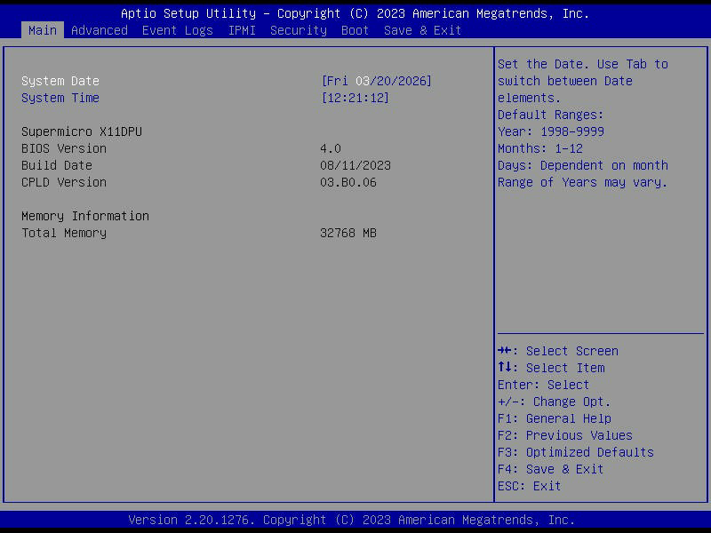
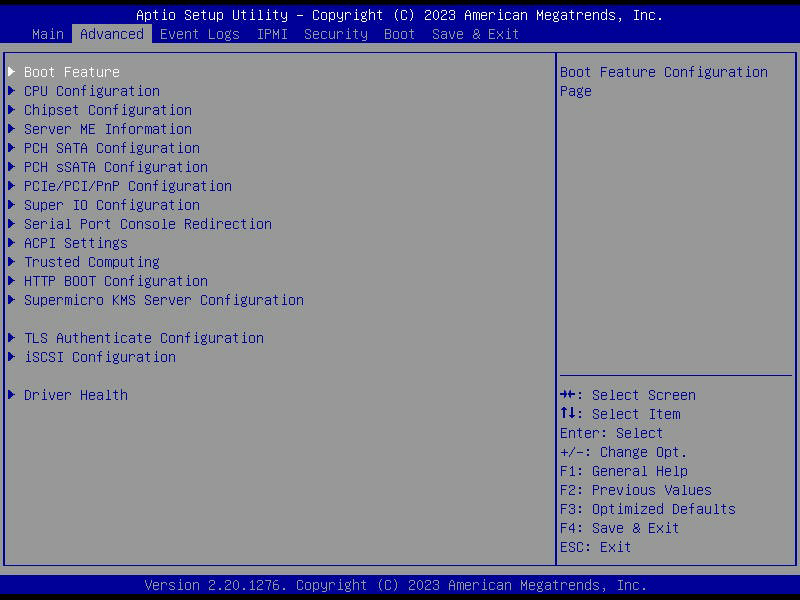
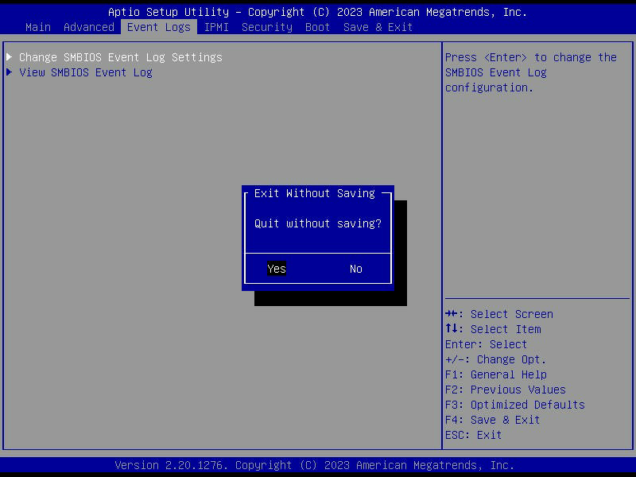
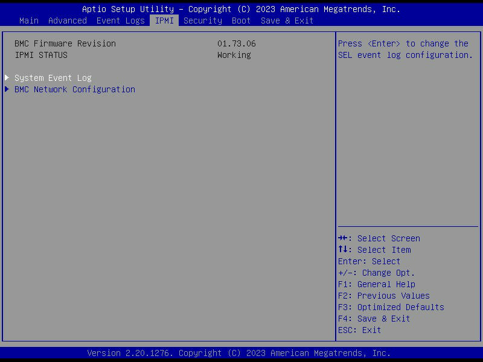
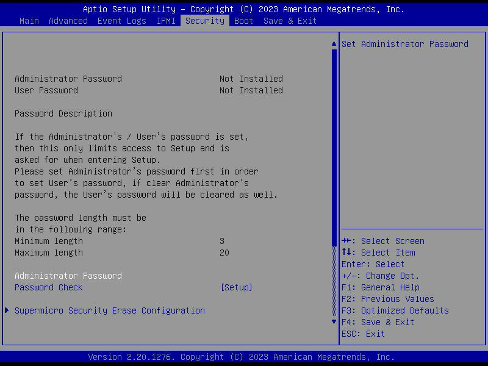
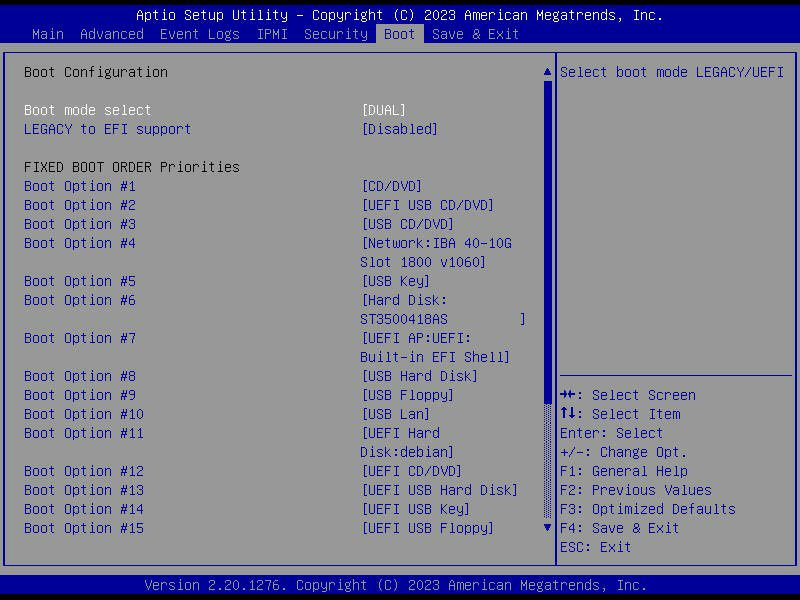
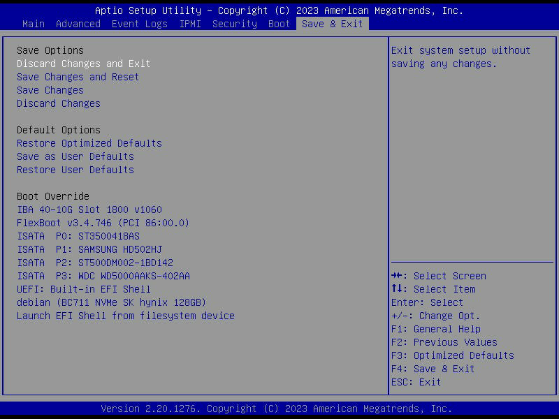

# Supermicro X11DPU BIOS Setup リモート操作スキル作成レポート

- **実施日時**: 2026年3月20日 21:37 JST

## 前提・目的

Supermicro X11DPU (4-6号機) の BIOS 設定をリモートで変更する手段を確立する。

- **背景**: Redfish BIOS API (`/redfish/v1/Systems/1/Bios`) は DCMS ライセンスが必要で使用不可。IPMI raw コマンドによる BIOS 操作手段もない
- **目的**: KVM スクリーンショット + キーストローク送信で BIOS Setup を操作する Claude-in-the-loop インタラクティブ方式を実装する
- **対象**: ブート順序以外の BIOS 設定 (CPU設定、メモリ設定、シリアルリダイレクション等)。ブート順序は既存の `bmc-power.sh` (Redfish boot-override) で対応済み

## 環境情報

- 対象サーバ: 4号機 (BMC: 10.10.10.24, Supermicro X11DPU)
- BIOS: AMI Aptio Setup Utility, BIOS Version 4.0, Build Date 08/11/2023
- CPLD Version: 03.B0.06
- BMC Firmware: 01.73.06
- KVM: InsydeVNC (HTML5 iKVM viewer, noVNC ベース)

## 成果物

### 1. `scripts/bmc-kvm-interact.py`

既存の `scripts/bmc-kvm-screenshot.py` を拡張した KVM 操作スクリプト。

**コマンド**:
| コマンド | 説明 |
|---------|------|
| `screenshot <output.png>` | スクリーンショット撮影 |
| `sendkeys <key1> [key2] ...` | キー送信 (--wait, --screenshot, --post-wait オプション) |
| `type <text>` | テキスト入力 |

**使用例**:
```sh
# BIOS 進入 (POST 中に Delete 連打)
.venv/bin/python scripts/bmc-kvm-interact.py \
    --bmc-ip 10.10.10.24 --bmc-user claude --bmc-pass Claude123 \
    sendkeys Delete Delete Delete Delete Delete Delete Delete Delete Delete Delete \
    --wait 500 --screenshot tmp/<sid>/bios.png --post-wait 3000
```

**キー送信方式**: Playwright `page.keyboard.press()` — noVNC canvas にフォーカス後、DOM キーイベントを発火。InsydeVNC の RFB クライアントに正常に届くことを確認済み。

### 2. `.claude/skills/bios-setup/SKILL.md`

BIOS Setup 操作のスキル定義。サブコマンド (enter, screenshot, navigate, set, verify, save-exit) の手順とタブ構造、キー操作リファレンスを記載。

## 検証結果

### キーストローク送信テスト

| テスト | 結果 |
|-------|------|
| ログイン画面で "root" を type | 成功 — 文字が入力された |
| POST 中に Delete 連打 | 成功 — BIOS Setup に入れた |
| ArrowRight でタブ切替え | 成功 (ただし条件あり — 下記参照) |
| ArrowDown でメニュー項目選択 | 成功 |
| Tab+Enter で Exit ダイアログの "No" 選択 | 成功 |
| Enter で Exit ダイアログの "Yes" 選択 | 成功 |

### BIOS タブ構造

全7タブのスクリーンショットを取得:

| タブ | スクリーンショット |
|------|------------------|
| Main |  |
| Advanced |  |
| Event Logs |  |
| IPMI |  |
| Security |  |
| Boot |  |
| Save & Exit |  |

### 発見した注意事項

#### 1. ArrowLeft/Right のタブ切替えはカーソル位置に依存

AMI BIOS では、ArrowLeft/Right の動作がカーソル位置のアイテム種別に依存する:

- **日付/時刻フィールド**: フィールド内コンポーネント間を移動、末端でタブ切替え
- **サブメニュー項目 (►)**: サブメニューに入る（タブ切替えしない）
- **情報表示項目**: タブ切替え

**対策**: スクリーンショットを見ながら、ArrowDown で非サブメニュー項目に移動してからタブ切替えする。

#### 2. Escape キーの挙動

- サブメニュー内: 親メニューに戻る
- トップレベル: "Exit Without Saving" ダイアログ表示
- Exit ダイアログの "No" 選択: **Escape ではなく Tab+Enter**

Escape の連打は Exit ダイアログの無限ループを引き起こす。

#### 3. KVM セッションの共有

BMC の KVM は同時1セッションの入力を共有する。複数の Playwright セッションを並行して接続すると、全てのキーイベントが同じ VNC セッションに送られ、意図しないキー操作が発生する。操作は常にシーケンシャルに行うこと。

#### 4. POST タイミング

- Power Cycle のデフォルト待機: 15秒
- POST (PEI → DXE → CSM → Boot): 約20-40秒
- KVM 接続確立: 約8秒
- Delete 連打は KVM 接続後すぐに開始し、POST 中に BIOS 進入プロンプトが表示されるタイミングを捉える

## 再現方法

1. KVM スクリーンショットの撮影:
```sh
.venv/bin/python scripts/bmc-kvm-interact.py \
    --bmc-ip 10.10.10.24 --bmc-user claude --bmc-pass Claude123 \
    screenshot tmp/<sid>/screen.png
```

2. BIOS Setup 進入:
```sh
./pve-lock.sh run ./oplog.sh ./scripts/bmc-power.sh cycle 10.10.10.24 claude Claude123
# 直後に Delete 連打
.venv/bin/python scripts/bmc-kvm-interact.py \
    --bmc-ip 10.10.10.24 --bmc-user claude --bmc-pass Claude123 \
    sendkeys Delete Delete Delete Delete Delete Delete Delete Delete Delete Delete \
    Delete Delete Delete Delete Delete Delete Delete Delete Delete Delete \
    --wait 500 --screenshot tmp/<sid>/bios.png --post-wait 3000
```

3. タブ移動とスクリーンショット:
```sh
.venv/bin/python scripts/bmc-kvm-interact.py \
    --bmc-ip 10.10.10.24 --bmc-user claude --bmc-pass Claude123 \
    sendkeys ArrowRight --wait 300 --screenshot tmp/<sid>/next-tab.png --post-wait 1000
```
