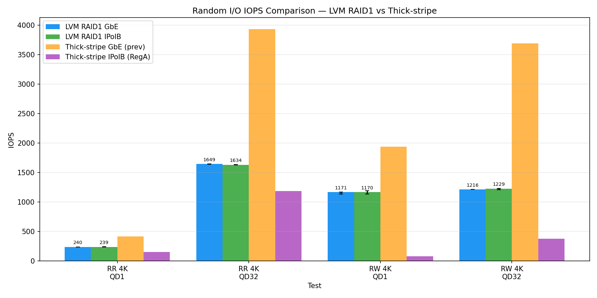
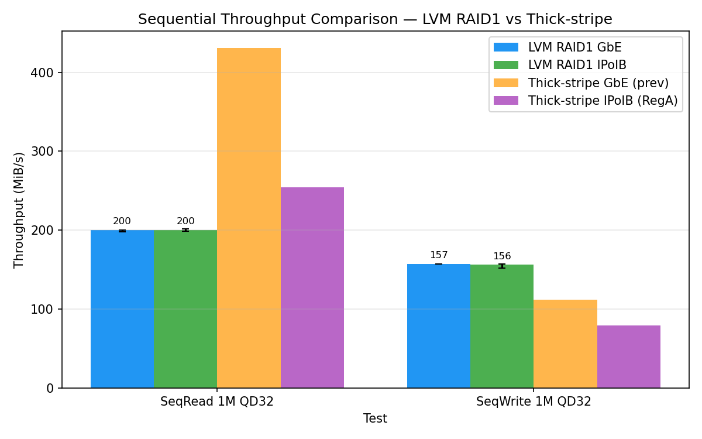

# LINSTOR LVM RAID1 ベンチマーク — Region B (7+9号機)

- **実施日時**: 2026年3月29日 15:00〜18:00 JST
- **セッション ID**: calm-wall

## 添付ファイル

- [実装プラン](attachment/2026-03-29_090042_linstor_lvm_raid1_benchmark/plan.md)
- [IOPS 比較グラフ](attachment/2026-03-29_090042_linstor_lvm_raid1_benchmark/iops_comparison.png)
- [スループット比較グラフ](attachment/2026-03-29_090042_linstor_lvm_raid1_benchmark/throughput_comparison.png)

## 前提・目的

### 背景

LINSTOR/DRBD 環境でディスク冗長性を LVM RAID1 (`--type raid1 -m 1`) で確保する構成の性能を評価する。LVM RAID1 は LINSTOR の `LvcreateOptions` で透過的に管理でき、md-raid や HW RAID 等の追加管理レイヤーが不要。

### 目的

1. LVM RAID1 構成での fio ベンチマーク（6テスト × 3回 × GbE/IPoIB）
2. 過去の thick-stripe 構成との性能比較
3. GbE vs IPoIB の差異を定量化

### 参照レポート

- [LINSTOR thick-stripe ベンチマーク Region B (2026-03-19)](2026-03-19_173724_linstor_thick_stripe_benchmark_region_b.md)
- [LINSTOR thin vs thick-stripe ベンチマーク Region A (2026-02-26)](2026-02-26_130844_linstor_thin_vs_thick_stripe_benchmark.md)
- [LINSTOR ディスク個別 Pool 調査レポート (2026-03-28)](2026-03-28_000658_linstor_per_disk_pool_investigation.md)
- [中間レポート: RAID 構成フェーズ (2026-03-29)](2026-03-29_062142_linstor_lvm_raid1_setup_progress.md)

## 環境情報

### ハードウェア

| 項目 | 7号機 | 9号機 |
|------|-------|-------|
| サーバ | DELL PowerEdge R320 | DELL PowerEdge R320 |
| CPU | Xeon E5-2420 v2 (6C/12T) | Xeon E5-2420 v2 (6C/12T) |
| メモリ | 48 GiB DDR3 | 48 GiB DDR3 |
| RAID | PERC H710 Mini | PERC H710 Mini |
| OS VD | RAID-1, 278.88 GB (Bay 0+1) | RAID-1, 558.38 GB (Bay 0+1) |
| Data VD | RAID-0 × 6 (Bay 2-7, 各 837.75 GB) | RAID-0 × 4 (Bay 3-6, 各 837.75 GB) |
| ネットワーク | GbE + ConnectX-3 QDR (PCIe x4 制約 ~16Gbps) | 同左 |

### ディスク構成 (7号機)

| Bay | Size | Vendor | VD | 用途 |
|-----|------|--------|-----|------|
| 0 | 278.88 GB | HP | VD0 RAID-1 | OS |
| 1 | 278.88 GB | HP | VD0 RAID-1 | OS |
| 2 | 837.75 GB | SAS | VD1 RAID-0 | LINSTOR (linstor_vg) |
| 3 | 837.75 GB | SAS | VD2 RAID-0 | LINSTOR (linstor_vg) |
| 4 | 837.75 GB | SAS | VD3 RAID-0 | LINSTOR (linstor_vg) |
| 5 | 837.75 GB | SAS | VD4 RAID-0 | LINSTOR (linstor_vg) |
| 6 | 837.75 GB | SAS | VD5 RAID-0 | LINSTOR (linstor_vg) |
| 7 | 837.75 GB | SAS | VD6 RAID-0 | LINSTOR (linstor_vg) |

### ディスク構成 (9号機)

| Bay | Size | Vendor | VD | 用途 |
|-----|------|--------|-----|------|
| 0 | 558.38 GB | HP | VD0 RAID-1 | OS |
| 1 | 558.38 GB | HP | VD0 RAID-1 | OS |
| 2 | 837.75 GB | — | — | 不良 (STOR062) |
| 3 | 837.75 GB | SEAGATE | VD1 RAID-0 | LINSTOR (linstor_vg) |
| 4 | 837.75 GB | SEAGATE | VD2 RAID-0 | LINSTOR (linstor_vg) |
| 5 | 837.75 GB | SEAGATE | VD3 RAID-0 | LINSTOR (linstor_vg) |
| 6 | 837.75 GB | SEAGATE | VD4 RAID-0 | LINSTOR (linstor_vg) |

### ソフトウェア

| 項目 | バージョン |
|------|-----------|
| OS (ホスト) | Debian 13.3 (Trixie) + Proxmox VE 9.1.6 |
| カーネル | 6.17.13-2-pve |
| OS (VM) | Debian 13 (cloud image) |
| DRBD | 9.3.1 (drbd-dkms) |
| LINSTOR | 1.33.1 (Controller on 4号機) |
| fio | 3.39 |

### DRBD 構成

| 項目 | 設定 |
|------|------|
| Protocol | C (同期レプリケーション) |
| Place count | 2 |
| Quorum | off |
| Auto-promote | yes |

### LINSTOR ストレージ構成

| 項目 | 設定 |
|------|------|
| VG | linstor_vg |
| Pool | striped-pool (LVM) |
| **LvcreateOptions** | **`--type raid1 -m 1`** |
| リソースグループ | pve-rg-b |
| PVE ストレージ | linstor-storage-b |

### ベンチマーク VM

| 項目 | 値 |
|------|-----|
| VM ID | 100 |
| vCPU | 4 (host) |
| メモリ | 4096 MiB |
| ディスク | 32 GiB (scsi0, virtio-scsi-single, iothread) |
| ネットワーク | net0=vmbr1 (DHCP), net1=vmbr0 (10.10.10.210/8) |

## ベンチマーク結果

### GbE (中央値, 3回実施)

| テスト | IOPS | BW (MiB/s) | min | max |
|--------|------|-----------|-----|-----|
| RandRead 4K QD1 | 239 | 0.9 | 238 | 240 |
| RandRead 4K QD32 | 1,642 | 6.4 | 1,642 | 1,649 |
| RandWrite 4K QD1 | 1,137 | 4.4 | 1,137 | 1,171 |
| RandWrite 4K QD32 | 1,214 | 4.7 | 1,214 | 1,216 |
| SeqRead 1M QD32 | 200 | 200.3 | 198 | 200 |
| SeqWrite 1M QD32 | 157 | 157.1 | 157 | 157 |

*注: GbE Run 1 の RandRead QD1 (23 IOPS) は DRBD 同期直後の外れ値のため除外。Run 2+3 を使用。*

### IPoIB (中央値, 3回実施)

| テスト | IOPS | BW (MiB/s) | min | max |
|--------|------|-----------|-----|-----|
| RandRead 4K QD1 | 239 | 0.9 | 238 | 241 |
| RandRead 4K QD32 | 1,634 | 6.4 | 1,632 | 1,636 |
| RandWrite 4K QD1 | 1,170 | 4.6 | 1,136 | 1,193 |
| RandWrite 4K QD32 | 1,229 | 4.8 | 1,212 | 1,230 |
| SeqRead 1M QD32 | 200 | 200.1 | 199 | 201 |
| SeqWrite 1M QD32 | 156 | 156.2 | 152 | 157 |

### 過去データとの比較

| テスト | LVM RAID1 GbE | LVM RAID1 IPoIB | Thick-stripe GbE (prev) | Thick-stripe IPoIB (RegA) |
|--------|:---:|:---:|:---:|:---:|
| RandRead 4K QD1 | 239 | 239 | **418** | 156 |
| RandRead 4K QD32 | 1,642 | 1,634 | **3,935** | 1,185 |
| RandWrite 4K QD1 | 1,137 | 1,170 | **1,938** | 78 |
| RandWrite 4K QD32 | 1,214 | 1,229 | **3,691** | 380 |
| SeqRead 1M QD32 | **200** MiB/s | **200** MiB/s | 431 MiB/s | 254 MiB/s |
| SeqWrite 1M QD32 | **157** MiB/s | **156** MiB/s | 112 MiB/s | 79 MiB/s |





## 分析

### 1. GbE vs IPoIB: 差異なし

GbE と IPoIB で性能差がほぼない。これは **SAS HDD のランダム I/O がボトルネック** であり、ネットワーク帯域は GbE (1Gbps) でも飽和していないことを意味する。DRBD Protocol C の同期レプリケーションで必要なネットワーク帯域は 4.8 MiB/s (randwrite QD32) 程度で、GbE の理論帯域 (~120 MiB/s) の 4% に過ぎない。

### 2. LVM RAID1 vs Thick-stripe: ランダム I/O で劣る

| テスト | Thick-stripe / RAID1 | 理由 |
|--------|:---:|------|
| RandRead QD1 | 1.7x | ストライプ = 4ディスク並列読み込み |
| RandRead QD32 | 2.4x | 同上、QD 効果で差拡大 |
| RandWrite QD1 | 1.7x | BBU キャッシュ + ストライプ効果 |
| RandWrite QD32 | 3.0x | 同上 |
| SeqRead QD32 | 2.2x | ストライプの帯域結合 |
| **SeqWrite QD32** | **0.7x** | **RAID1 が優勢** |

- **ランダム I/O**: Thick-stripe が 1.7〜3.0 倍優勢。4ディスクストライプが並列 I/O で圧倒的に有利
- **シーケンシャル書き込み**: LVM RAID1 が **40% 高速** (157 vs 112 MiB/s)。RAID1 のミラー書き込みは2ディスクへの同時書き込みで済むが、ストライプは4ディスク全てに書く必要がある。BBU ライトバックキャッシュも RAID1 のほうが効率的

### 3. Region A (SATA HDD + IPoIB) との比較

LVM RAID1 (Region B, SAS 10K) は Region A (SATA 7.2K) の thick-stripe を多くのテストで上回る:
- RandRead QD1: 239 vs 156 (**1.5x**)
- RandRead QD32: 1,634 vs 1,185 (**1.4x**)
- RandWrite QD1: 1,170 vs 78 (**15x** — BBU キャッシュ効果)
- SeqWrite QD32: 156 vs 79 (**2.0x**)

SAS 10K RPM + PERC H710 BBU の組み合わせが性能を大きく引き上げている。

### 4. LVM RAID1 のオーバーヘッド

LVM RAID1 は各 LV に対して2つのミラーレッグを作成する。ランダム読み込みでは1レッグからのみ読むため、ストライプ（4並列）と比較して不利。書き込みは2レッグに同時書き込みするため、ストライプ（4ディスク分散書き込み）と比較して有利な場合がある。

## 結論

1. **LVM RAID1 はディスク冗長性と引き換えにランダム I/O 性能が低下** — thick-stripe 比で 40-70% の性能
2. **シーケンシャル書き込みは RAID1 が優勢** — ストライプの書き込み分散オーバーヘッドが少ない
3. **GbE と IPoIB で差がない** — SAS HDD がボトルネックでネットワークは非飽和
4. **SAS 10K + BBU の効果は大きい** — SATA 7.2K (Region A) と比較して特に書き込み性能で圧倒的差
5. **LVM RAID1 は LINSTOR と透過的に統合でき、運用負荷が最小** — `LvcreateOptions` の1設定で完結

## 再現方法

```sh
# LVM VG 作成 (各ノード)
pvcreate /dev/sdb /dev/sdc /dev/sdd /dev/sde /dev/sdf /dev/sdg
vgcreate linstor_vg /dev/sdb /dev/sdc /dev/sdd /dev/sde /dev/sdf /dev/sdg

# LINSTOR ストレージプール (LVM RAID1)
linstor storage-pool create lvm <node> striped-pool linstor_vg
linstor storage-pool set-property <node> striped-pool \
  StorDriver/LvcreateOptions -- '--type raid1 -m 1'

# リソースグループ
linstor resource-group create pve-rg-b --place-count 2 --storage-pool striped-pool
linstor resource-group drbd-options --protocol C pve-rg-b
linstor resource-group drbd-options --quorum off pve-rg-b
linstor resource-group drbd-options --auto-promote yes pve-rg-b

# PVE ストレージ
pvesm add drbd linstor-storage-b --content images --controller 10.10.10.204 --resourcegroup pve-rg-b

# VM 作成 + fio ベンチマーク (linstor-bench スキル参照)
```
