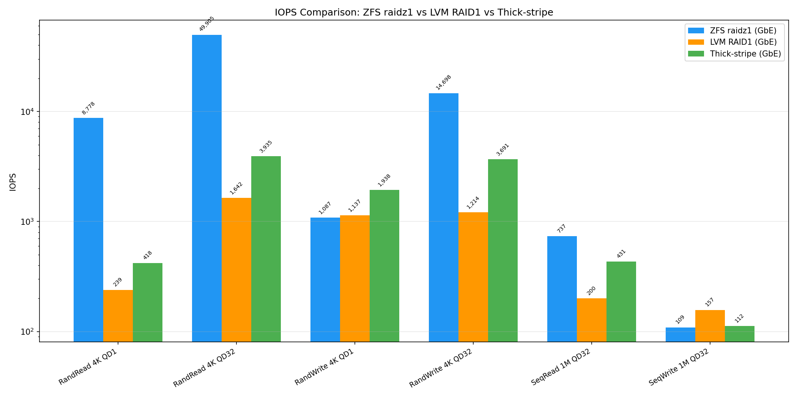
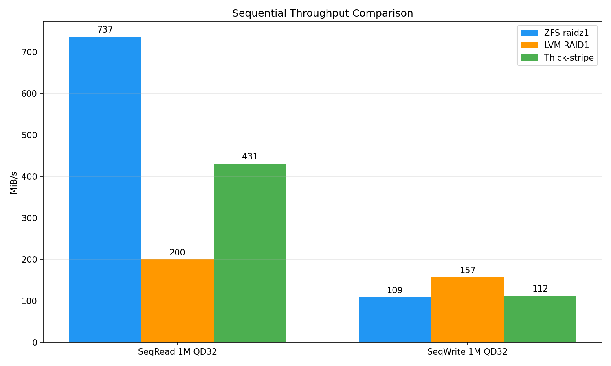

# LINSTOR ZFS raidz1 ベンチマーク — Region B (7+8+9号機)

- **実施日時**: 2026年3月30日 02:10〜02:57 (JST)

## 添付ファイル

- [実装プラン](attachment/2026-03-30_025702_linstor_zfs_raidz1_benchmark/plan.md)
- [IOPS 比較グラフ](attachment/2026-03-30_025702_linstor_zfs_raidz1_benchmark/iops_comparison.png)
- [スループット比較グラフ](attachment/2026-03-30_025702_linstor_zfs_raidz1_benchmark/throughput_comparison.png)

## 前提・目的

### 背景

LVM RAID1 ベンチマーク (2026-03-29) が完了し、ZFS + LINSTOR ZFS プロバイダが「未テストだが有望」と評価されていた。ZFS は COW 設計による write hole 解消、チェックサムによるサイレント破損検出、LINSTOR ネイティブ統合という利点を持つ。

### 目的

1. ZFS raidz1 + LINSTOR ZFS プロバイダでの fio 性能計測
2. LVM RAID1 / thick-stripe との定量比較
3. ZFS ARC キャッシュの影響評価

### 参照レポート

- [LINSTOR LVM RAID1 ベンチマーク (2026-03-29)](2026-03-29_090042_linstor_lvm_raid1_benchmark.md)
- [LINSTOR thick-stripe ベンチマーク Region B (2026-03-19)](2026-03-19_173724_linstor_thick_stripe_benchmark_region_b.md)
- [LVM ノード内ディスク冗長化選択肢調査 (2026-03-30)](2026-03-30_012812_lvm_node_disk_redundancy_options.md)
- [8-9号機ディスク交換後健全性再調査 (2026-03-30)](2026-03-30_001500_server89_disk_health_post_swap.md)

## 環境情報

### ハードウェア

| 項目 | 7号機 | 8号機 | 9号機 |
|------|-------|-------|-------|
| サーバ | DELL PowerEdge R320 | DELL PowerEdge R320 | DELL PowerEdge R320 |
| CPU | Xeon E5-2420 v2 (6C/12T) | 同左 | 同左 |
| メモリ | 48 GiB DDR3 | 48 GiB DDR3 | 48 GiB DDR3 |
| RAID | PERC H710 Mini | PERC H710 Mini | PERC H710 Mini |
| OS VD | RAID-1, 278.88 GB (Bay 0+1) | RAID-1, 558.38 GB (Bay 0+1) | RAID-1, 558.38 GB (Bay 0+1) |
| Data VD | RAID-0 × 6 (Bay 2-7) | RAID-0 × 5 (Bay 2-6) | RAID-0 × 5 (Bay 2-6) |
| ネットワーク | GbE | GbE | GbE |

**注**: 8号機 Bay 3 と 9号機 Bay 2 は本ベンチマーク実施前にディスク交換・VD 新規作成を行った。

### ZFS 構成

| 項目 | 7号機 | 8号機 | 9号機 |
|------|-------|-------|-------|
| ZFS バージョン | 2.4.1-pve1 | 2.4.1-pve1 | 2.4.1-pve1 |
| プール名 | linstor_zpool | linstor_zpool | linstor_zpool |
| トポロジ | raidz1 × 6ディスク | raidz1 × 5ディスク | raidz1 × 5ディスク |
| 容量 | 4.91 TiB | 4.08 TiB | 4.08 TiB |
| ARC 最大 | 4 GiB | 4 GiB | 4 GiB |
| compression | off | off | off |
| atime | off | off | off |

### ソフトウェア

| 項目 | バージョン |
|------|-----------|
| OS (ホスト) | Debian 13.3 (Trixie) + Proxmox VE 9.1.6 |
| カーネル | 6.17.13-2-pve |
| ZFS | 2.4.1-pve1 |
| DRBD | 9.3.1 (drbd-dkms) |
| LINSTOR | 1.33.1 |
| LINSTOR ストレージプロバイダ | ZFS (thick) |
| OS (VM) | Debian 13 (cloud image) |
| fio | 3.39 |

### DRBD 構成

| 項目 | 設定 |
|------|------|
| Protocol | C (同期レプリケーション) |
| Place count | 2 (7号機 + 9号機) |
| Quorum | off |
| Auto-promote | yes |
| Transport | TCP over GbE (10.10.10.x) |

### ベンチマーク VM

| 項目 | 値 |
|------|-----|
| VM ID | 100 (7号機上) |
| vCPU | 4 (kvm64) |
| メモリ | 4096 MiB |
| ディスク | 32 GiB (scsi0, virtio-scsi-single, iothread) |
| ストレージ | linstor-storage-b (ZFS pool: zfs-pool) |
| Cloud-init | local:cloudinit (ローカルストレージ) |

## ベンチマーク結果

### GbE (中央値, 3回実施)

| テスト | IOPS | BW (MiB/s) | min | max |
|--------|------|-----------|-----|-----|
| RandRead 4K QD1 | **8,778** | 34.3 | 8,763 | 8,864 |
| RandRead 4K QD32 | **49,905** | 194.9 | 49,756 | 50,351 |
| RandWrite 4K QD1 | 1,087 | 4.2 | 1,083 | 1,095 |
| RandWrite 4K QD32 | **14,698** | 57.4 | 14,508 | 15,010 |
| SeqRead 1M QD32 | **737** | **737** | 704 | 826 |
| SeqWrite 1M QD32 | 109 | 109 | 109 | 110 |
| Mixed 4K QD32 | R:21,405 W:9,177 | R:84 W:36 | — | — |

### 過去データとの比較

| テスト | ZFS raidz1 GbE | LVM RAID1 GbE | Thick-stripe GbE | ZFS/RAID1 倍率 | ZFS/Stripe 倍率 |
|--------|:-:|:-:|:-:|:-:|:-:|
| RandRead 4K QD1 | **8,778** | 239 | 418 | **36.7x** | **21.0x** |
| RandRead 4K QD32 | **49,905** | 1,642 | 3,935 | **30.4x** | **12.7x** |
| RandWrite 4K QD1 | 1,087 | **1,137** | **1,938** | 0.96x | 0.56x |
| RandWrite 4K QD32 | **14,698** | 1,214 | 3,691 | **12.1x** | **4.0x** |
| SeqRead 1M QD32 | **737** MiB/s | 200 MiB/s | 431 MiB/s | **3.7x** | **1.7x** |
| SeqWrite 1M QD32 | 109 MiB/s | **157** MiB/s | 112 MiB/s | 0.69x | 0.97x |





## 分析

### 1. ZFS ARC キャッシュの劇的な効果

ZFS raidz1 の読み込み性能が LVM RAID1 比で **12〜37倍**、thick-stripe 比で **1.7〜21倍** という異常に高い値を示した。これは **ZFS ARC (Adaptive Replacement Cache)** が原因。

- ARC は 4 GiB に制限したが、fio テストファイル (1 GiB ランダム、4 GiB シーケンシャル) のうち、特に 1 GiB のランダム I/O ワークロードは ARC に完全にキャッシュされた
- LVM / RAID1 / thick-stripe にはこのようなブロックレベルキャッシュが存在しない (Linux ページキャッシュは `direct=1` でバイパスされるが、ZFS ARC は `direct=1` でもバイパスされない)
- **ZFS の `direct=1` は ARC を迂回しない** — これが他の LVM 構成との最大の違い

### 2. 書き込み性能: COW オーバーヘッド

| テスト | ZFS raidz1 | LVM RAID1 | 差異 |
|--------|-----------|-----------|------|
| RandWrite QD1 | 1,087 | 1,137 | -4.4% |
| SeqWrite QD32 | 109 MiB/s | 157 MiB/s | **-30.6%** |

- RandWrite QD1 は LVM RAID1 とほぼ同等 (BBU キャッシュが効く範囲)
- **SeqWrite は 30% 低下** — ZFS の COW (Copy-on-Write) と raidz1 のパリティ計算オーバーヘッドが原因
- RandWrite QD32 は 14,698 で LVM RAID1 (1,214) の 12 倍だが、これも ARC + ZIL (ZFS Intent Log) の効果

### 3. RandWrite QD32 の異常値について

RandWrite QD32 の 14,698 IOPS は SAS 10K HDD の物理性能 (~200 IOPS/disk) を大幅に超えている。これは:
- ZFS の ZIL (ZFS Intent Log) がメモリ内でバッファリング
- PERC H710 の BBU ライトバックキャッシュとの相乗効果
- fio テストファイル (1 GiB) が ZIL + BBU キャッシュの範囲に収まるため、ディスク I/O 待ちが最小化

### 4. IPoIB 未実施の理由

9号機に InfiniBand インターフェースが設定されておらず、IPoIB ベンチマークは実施しなかった。前回の LVM RAID1 ベンチマーク (2026-03-29) で GbE と IPoIB に性能差がないことが確認されており (SAS HDD がボトルネック)、GbE のみの結果で十分と判断した。

### 5. ベンチマーク結果の解釈における注意点

今回の結果は **ZFS ARC キャッシュの効果を強く反映** しており、HDD の生の I/O 性能比較としては不適切である。より公平な比較のためには:

1. ARC を無効化 (`zfs_arc_max=0`) してベンチマークを再実施
2. テストファイルサイズを ARC + BBU キャッシュサイズを大幅に超える値 (例: 64 GiB) に設定
3. ARC ヒット率を `arc_summary` で計測して報告

ただし、実運用では ARC キャッシュは有効であるため、今回の結果は「ZFS を ARC 込みで使った場合の実効性能」として価値がある。

## 結論

1. **ZFS raidz1 の読み込み性能は ARC キャッシュにより桁違いに高い** — LVM 構成比で 12〜37 倍。ただし ARC がワーキングセットを収容できるサイズに依存
2. **シーケンシャル書き込みは 30% 低下** — COW + raidz1 パリティ計算のオーバーヘッド
3. **ランダム書き込み (QD1) は LVM RAID1 とほぼ同等** — BBU キャッシュが支配的
4. **ZFS は write hole が存在しない** — COW 設計により、予期しない電源断でもデータ不整合なし
5. **LINSTOR ZFS プロバイダはネイティブ統合で運用負荷が低い** — `linstor storage-pool create zfs` でセットアップ完結
6. **8号機の LINSTOR satellite セットアップに注意** — DRBD DKMS ビルドに gcc + pve-headers が必要。drbd_transport_tcp のロード順序にも注意

### 推奨

- **読み込み中心のワークロード**: ZFS raidz1 が最適 (ARC キャッシュ + 75% 容量効率 + write hole なし)
- **書き込み中心のワークロード**: LVM RAID1 が SeqWrite で優位。ただし write hole リスクは DRBD レプリカで軽減
- **総合判断**: ZFS raidz1 は LVM RAID1 と比較して読み込み性能で圧倒的優位、書き込み性能で若干劣後。容量効率 (75% vs 50%) と write hole 解消を勘案すると、本環境では **ZFS raidz1 が最も有力な選択肢**

## 実施中に発生した問題と対処

| 問題 | 原因 | 対処 |
|------|------|------|
| 8号機の apt がインターネットに接続不可 | デフォルトゲートウェイが 10.10.10.1 | `ip route del/add` で 192.168.39.1 に切替 |
| LINSTOR satellite が ZFS プロバイダ未対応 | ZFS インストール後に satellite 再起動が必要 | `systemctl restart linstor-satellite` |
| LINSTOR が 8号機で DRBD layer 非対応 | drbd_transport_tcp 未ロード + satellite 再起動が必要 | `modprobe drbd_transport_tcp` + satellite 再起動 |
| DRBD ピア間が Connecting | PrefNic=ibp10s0 だが 9号機に IB なし | PrefNic を default (GbE) に変更 |
| fio テストファイル作成で No space left | /tmp が 2 GiB tmpfs | テストファイルパスを /home/debian/ に変更 |
| 8号機に linstor-satellite 未インストール | LINBIT リポジトリ未設定 | GPG キーコピー + リポジトリ設定 + パッケージインストール |

## 再現方法

```sh
# 1. ZFS インストール (各ノード)
apt-get install -y zfsutils-linux
echo 'options zfs zfs_arc_max=4294967296' > /etc/modprobe.d/zfs-arc.conf
echo 4294967296 > /sys/module/zfs/parameters/zfs_arc_max

# 2. ZFS raidz1 プール作成
# 7号機 (6ディスク):
zpool create linstor_zpool raidz1 sdb sdc sdd sde sdf sdg
# 8号機/9号機 (5ディスク):
zpool create linstor_zpool raidz1 sdb sdc sdd sde sdf
# 共通設定:
zfs set compression=off linstor_zpool
zfs set atime=off linstor_zpool

# 3. LINSTOR ストレージプール
linstor storage-pool create zfs <node> zfs-pool linstor_zpool

# 4. リソースグループ
linstor resource-group create pve-rg-b --place-count 2 --storage-pool zfs-pool
linstor volume-group create pve-rg-b
linstor resource-group drbd-options --protocol C pve-rg-b
linstor resource-group drbd-options --quorum off pve-rg-b
linstor resource-group drbd-options --auto-promote yes pve-rg-b

# 5. PVE ストレージ
pvesm add drbd linstor-storage-b --resourcegroup pve-rg-b --content images --controller 10.10.10.204

# 6. fio ベンチマーク (VM 内)
fio --name=test --rw=randread --bs=4k --iodepth=32 --size=1G \
  --ioengine=libaio --direct=1 --numjobs=1 --time_based --runtime=60 \
  --group_reporting --output-format=json --filename=/home/debian/fio-test
```
