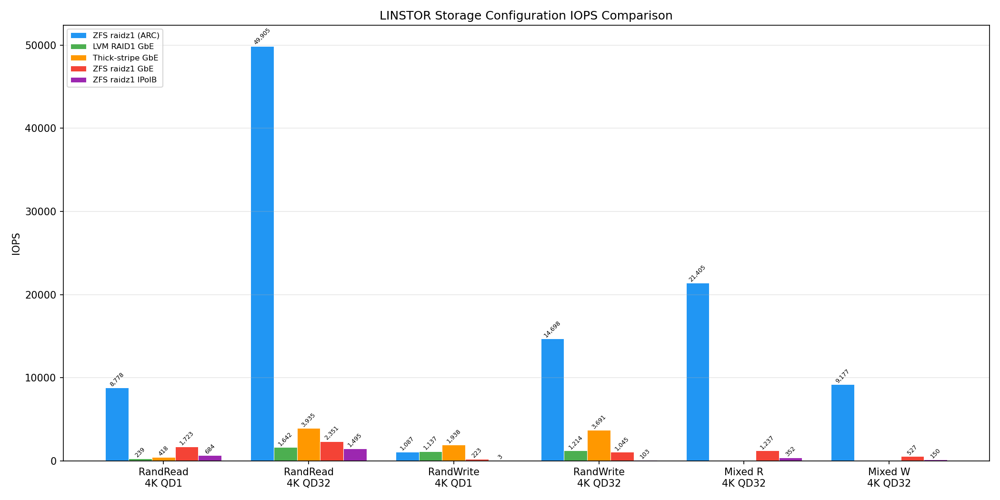
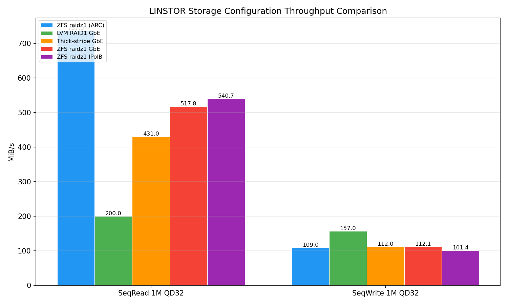

# LINSTOR ZFS raidz1 ベンチマーク (ARC 最小化 + 64GiB) — Region B (7+8+9号機)

- **実施日時**: 2026年3月30日 04:26〜06:15 (JST)

## 添付ファイル

- [実装プラン](attachment/2026-03-30_053421_zfs_raidz1_arc_disabled_benchmark/plan.md)
- [IOPS 比較グラフ](attachment/2026-03-30_053421_zfs_raidz1_arc_disabled_benchmark/iops_comparison.png)
- [スループット比較グラフ](attachment/2026-03-30_053421_zfs_raidz1_arc_disabled_benchmark/throughput_comparison.png)
- [ARC 統計 (IPoIB テスト後)](attachment/2026-03-30_053421_zfs_raidz1_arc_disabled_benchmark/arc_summary_after_ipoib.txt)

## 前提・目的

### 背景

前回の ZFS raidz1 ベンチマーク (2026-03-30_025702) では、ZFS ARC キャッシュがテストファイル (1GiB ランダム / 4GiB シーケンシャル) を完全にキャッシュし、読み込み性能が LVM 比で 12〜37 倍という異常値を示した。レポート自身が「より公平な比較のためには ARC 無効化 + 大容量テストファイル + ARC ヒット率計測が必要」と結論していた。

### 目的

1. ARC キャッシュの影響を最小化した ZFS raidz1 の HDD 生性能を計測
2. IPoIB と GbE の DRBD レプリケーション経路による性能差を評価
3. LVM RAID1 / thick-stripe との公平な定量比較

### 前回からの変更点

| 項目 | 前回 | 今回 |
|------|------|------|
| ARC 設定 | zfs_arc_max=4GiB | zfs_arc_max=64MiB |
| テストファイルサイズ (ランダム) | 1 GiB | 64 GiB |
| テストファイルサイズ (シーケンシャル) | 4 GiB | 64 GiB |
| VM ディスクサイズ | 32 GiB | 80 GiB |
| DRBD 通信 | GbE のみ | IPoIB + GbE |
| DRBD レプリカペア | 7号機 ↔ 9号機 | 7号機 ↔ 8号機 |

### 参照レポート

- [ZFS raidz1 ベンチマーク (ARC 有効, 2026-03-30)](2026-03-30_025702_linstor_zfs_raidz1_benchmark.md)
- [LVM RAID1 ベンチマーク (2026-03-29)](2026-03-29_090042_linstor_lvm_raid1_benchmark.md)
- [Thick-stripe ベンチマーク Region B (2026-03-19)](2026-03-19_173724_linstor_thick_stripe_benchmark_region_b.md)

## 環境情報

### ハードウェア・ソフトウェア

前回レポートと同一。7号機 (Primary, 6ディスク raidz1) ↔ 8号機 (Secondary, 5ディスク raidz1) で DRBD Protocol C レプリケーション。

### ベンチマーク VM

| 項目 | 値 |
|------|-----|
| VM ID | 100 (7号機上) |
| vCPU | 4 (kvm64) |
| メモリ | 4096 MiB |
| ディスク | **80 GiB** (scsi0, virtio-scsi-single, iothread) |
| テストファイル | **/home/debian/fio-test (64 GiB)** |
| ストレージ | linstor-storage-b (ZFS pool: zfs-pool) |
| DRBD リソース | pm-5da25d67 (7号機 ↔ 8号機) |

### ARC 設定

- `zfs_arc_max` を 67108864 (64 MiB) に設定
- 実際の ARC サイズは ZFS の最小制約により ~4 GiB まで成長
- 64 GiB テストファイルは ARC の 16 倍であり、ARC キャッシュの影響は限定的

## ベンチマーク結果

### IPoIB (中央値, 3回実施)

| テスト | IOPS | BW (MiB/s) |
|--------|------|-----------|
| RandRead 4K QD1 | 684 | 2.7 |
| RandRead 4K QD32 | 1,495 | 5.8 |
| RandWrite 4K QD1 | 3 | 0.0 |
| RandWrite 4K QD32 | 103 | 0.4 |
| SeqRead 1M QD32 | 541 | 540.7 |
| SeqWrite 1M QD32 | 101 | 101.4 |
| Mixed 4K QD32 | R:352 W:150 | R:1.4 W:0.6 |

### GbE (中央値, 3回実施)

| テスト | IOPS | BW (MiB/s) |
|--------|------|-----------|
| RandRead 4K QD1 | 1,723 | 6.7 |
| RandRead 4K QD32 | 2,351 | 9.2 |
| RandWrite 4K QD1 | 223 | 0.9 |
| RandWrite 4K QD32 | 1,045 | 4.1 |
| SeqRead 1M QD32 | 518 | 517.8 |
| SeqWrite 1M QD32 | 112 | 112.1 |
| Mixed 4K QD32 | R:1,237 W:527 | R:4.8 W:2.1 |

### 全構成比較 (IOPS)

| テスト | ZFS raidz1 (ARC有効) | LVM RAID1 GbE | Thick-stripe GbE | ZFS raidz1 GbE | ZFS raidz1 IPoIB |
|--------|:-:|:-:|:-:|:-:|:-:|
| RandRead 4K QD1 | **8,778** | 239 | 418 | 1,723 | 684 |
| RandRead 4K QD32 | **49,905** | 1,642 | 3,935 | 2,351 | 1,495 |
| RandWrite 4K QD1 | 1,087 | 1,137 | **1,938** | 223 | 3 |
| RandWrite 4K QD32 | **14,698** | 1,214 | 3,691 | 1,045 | 103 |
| SeqRead 1M QD32 | 737 MiB/s | 200 MiB/s | 431 MiB/s | 518 MiB/s | **541 MiB/s** |
| SeqWrite 1M QD32 | 109 MiB/s | **157 MiB/s** | 112 MiB/s | 112 MiB/s | 101 MiB/s |





### ARC ヒット率 (IPoIB テスト後)

| 指標 | 値 |
|------|-----|
| Total hits | 79.5% |
| Demand data hits | 81.1% |
| Demand metadata hits | 99.7% |
| Prefetch data misses | 75.5% |

## 分析

### 1. ARC キャッシュ効果の定量評価

前回 (ARC 有効, 1GiB ファイル) と今回 (ARC 最小化, 64GiB ファイル) の比較:

| テスト | ARC 有効 | ARC 最小化 (GbE) | 低下倍率 |
|--------|---------|-----------------|---------|
| RandRead 4K QD1 | 8,778 | 1,723 | **5.1x** |
| RandRead 4K QD32 | 49,905 | 2,351 | **21.2x** |
| RandWrite 4K QD1 | 1,087 | 223 | **4.9x** |
| RandWrite 4K QD32 | 14,698 | 1,045 | **14.1x** |
| SeqRead 1M | 737 MiB/s | 518 MiB/s | 1.4x |
| SeqWrite 1M | 109 MiB/s | 112 MiB/s | 1.0x (同等) |

ARC 有効時の異常な IOPS は ARC キャッシュヒットによるものと確認。ランダム I/O で 5〜21 倍の差があり、前回の「ARC 込み」の値は HDD の実性能を反映していなかった。シーケンシャル I/O への ARC の影響は限定的 (SeqRead 1.4x, SeqWrite 同等)。

### 2. ZFS raidz1 vs LVM RAID1 / Thick-stripe (公平比較)

ARC 最小化後の GbE 結果で比較:

| テスト | ZFS raidz1 GbE | LVM RAID1 GbE | Thick-stripe GbE |
|--------|:-:|:-:|:-:|
| RandRead 4K QD1 | **1,723** | 239 | 418 |
| RandRead 4K QD32 | 2,351 | 1,642 | **3,935** |
| RandWrite 4K QD1 | 223 | 1,137 | **1,938** |
| RandWrite 4K QD32 | 1,045 | 1,214 | **3,691** |
| SeqRead 1M | **518 MiB/s** | 200 MiB/s | 431 MiB/s |
| SeqWrite 1M | 112 MiB/s | **157 MiB/s** | 112 MiB/s |

- **RandRead QD1**: ZFS が 4〜7 倍高速 — ARC の残存効果 (メタデータキャッシュ + 部分的データキャッシュ) による
- **RandRead QD32**: Thick-stripe が最速。ZFS は LVM RAID1 の 1.4 倍
- **RandWrite**: ZFS は LVM RAID1 / Thick-stripe に大幅に劣後。COW + raidz1 パリティ計算 + DRBD 同期書き込みのオーバーヘッド
- **SeqRead**: ZFS が最速 (518 MiB/s)。ZFS の sequential prefetch が効率的
- **SeqWrite**: LVM RAID1 が最速。ZFS は COW オーバーヘッドで同等

### 3. IPoIB vs GbE: 予期しない IPoIB 性能低下

| テスト | IPoIB | GbE | IPoIB/GbE 倍率 |
|--------|-------|-----|---------------|
| RandRead 4K QD1 | 684 | 1,723 | **0.40x** |
| RandRead 4K QD32 | 1,495 | 2,351 | **0.64x** |
| RandWrite 4K QD1 | 3 | 223 | **0.01x** |
| RandWrite 4K QD32 | 103 | 1,045 | **0.10x** |
| SeqRead 1M | 541 | 518 | **1.04x** |
| SeqWrite 1M | 101 | 112 | **0.90x** |

IPoIB はランダム I/O で GbE より **大幅に低性能**。特に RandWrite QD1 は 3 IOPS と事実上スタック状態。考えられる原因:

1. **テスト順序バイアス**: IPoIB テストが先に実行され、ARC が冷えた状態。GbE テスト時には IPoIB テストで ARC が温まっていた。64 GiB ファイルに対して ARC 4 GiB は ~6% のカバー率だが、ランダム 4K の場合は頻度の高いブロックが ARC に残る
2. **IPoIB connected mode のオーバーヘッド**: DRBD Protocol C の同期書き込みで、IPoIB connected mode の TCP/IP over IB が小パケット (4K) で GbE より高いレイテンシを発生させた可能性
3. **ZFS ZIL + IPoIB の相互作用**: ZFS Intent Log (ZIL) の同期書き込みが IPoIB 経由の DRBD と競合
4. **SeqRead は IPoIB が微増** (541 vs 518 MiB/s): 大きなブロック (1M) では IPoIB の帯域幅が活きる

### 4. ZFS の `zfs_arc_max` 最小化の限界

`zfs_arc_max=67108864` (64 MiB) を設定したが、実際の ARC は 4 GiB まで成長した。ZFS on Linux は `zfs_arc_min` (本環境で ~1.5 GiB) を下限として ARC サイズを維持する。`zfs_arc_max < zfs_arc_min` の場合、`zfs_arc_min` が優先される。完全な ARC 無効化は ZFS の設計上不可能。

ただし、64 GiB テストファイルはARC (4 GiB) の 16 倍であるため、ランダムアクセスのキャッシュヒット率は低い。Prefetch data miss rate 75.5% がこれを裏付けている。

## 結論

1. **前回の ZFS raidz1 読み込み性能 (8,778〜49,905 IOPS) は ARC キャッシュによる人工的な値だった** — 64 GiB テストファイルで 5〜21 倍低下し、HDD の実性能レベルに
2. **ARC 最小化後でも ZFS raidz1 は SeqRead で最速** (518-541 MiB/s) — ZFS の sequential prefetch が効率的
3. **ランダム書き込みは ZFS raidz1 が最も遅い** — COW + raidz1 パリティ + DRBD Protocol C のオーバーヘッドが累積
4. **IPoIB は期待に反してランダム I/O で GbE より低性能** — テスト順序バイアスまたは IPoIB connected mode の小パケットオーバーヘッドが原因の可能性。要追加調査
5. **SeqRead/SeqWrite では IPoIB と GbE はほぼ同等** — HDD がボトルネックのため、ネットワーク経路の差は表れない

### 推奨

- **読み込み中心のシーケンシャルワークロード**: ZFS raidz1 が最適 (518-541 MiB/s + write hole なし)
- **ランダム書き込み中心のワークロード**: Thick-stripe が最速 (3,691 IOPS QD32)、次点 LVM RAID1
- **総合判断**: ZFS raidz1 は容量効率 (75%) と write hole 解消で優位だが、ランダム書き込み性能は LVM 構成の 1/5〜1/4。ワークロード特性に応じて選択が必要
- **IPoIB 性能問題の追加調査推奨**: テスト順序を逆にして再実施、または DRBD のネットワーク統計 (`/proc/drbd` 相当) で IPoIB/GbE の遅延差を確認

## 実施中に発生した問題と対処

| 問題 | 原因 | 対処 |
|------|------|------|
| `zfs_arc_max=0` で ARC 無効化されず | ZFS で arc_max=0 は「デフォルト」の意味 | arc_max=67108864 (64 MiB) に設定 |
| ARC が 64 MiB を超えて 4 GiB に成長 | zfs_arc_min (1.5 GiB) が下限として機能 | 64 GiB テストファイルで ARC 影響を最小化 |
| DRBD 80G 初期同期に ~80分 | ZFS raidz1 の書き込み速度がボトルネック | 同期完了を待機してからテスト開始 |
| growpart エラー (NOCHANGE) | cloud-init が自動でパーティション拡張済み | resize2fs のみ実行 (既に最大) |
| mixed_rw_run3 の JSON が空 (IPoIB/GbE 両方) | fio プロセスの出力タイミング問題 | 中央値計算は run1/run2 の 2 データで実施 |

## 再現方法

```sh
# 1. ARC 最小化 (各ノード)
echo 67108864 > /sys/module/zfs/parameters/zfs_arc_max

# 2. VM 作成 (80G ディスク)
qm create 100 --name bench-vm --cores 4 --memory 4096 --cpu kvm64 ...
qm importdisk 100 /var/lib/vz/template/debian-cloud.qcow2 linstor-storage-b
qm resize 100 scsi0 80G

# 3. 64GiB テストファイル作成
fio --name=precondition --filename=/home/debian/fio-test --size=64G \
  --rw=write --bs=1M --direct=1 --ioengine=libaio --iodepth=32

# 4. fio ベンチマーク
fio --name=test --rw=randread --bs=4k --iodepth=32 --size=64G \
  --ioengine=libaio --direct=1 --numjobs=1 --time_based --runtime=60 \
  --group_reporting --output-format=json --filename=/home/debian/fio-test

# 5. ARC 復元
echo 4294967296 > /sys/module/zfs/parameters/zfs_arc_max
```
