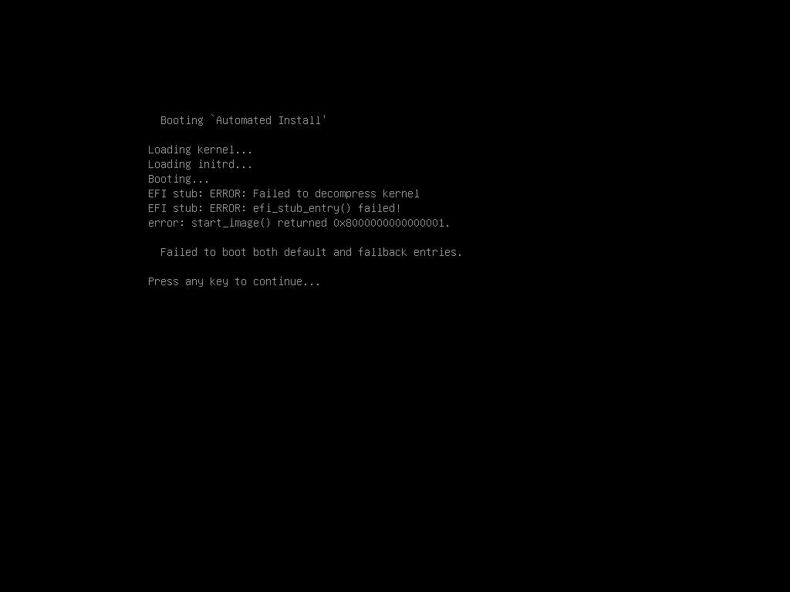
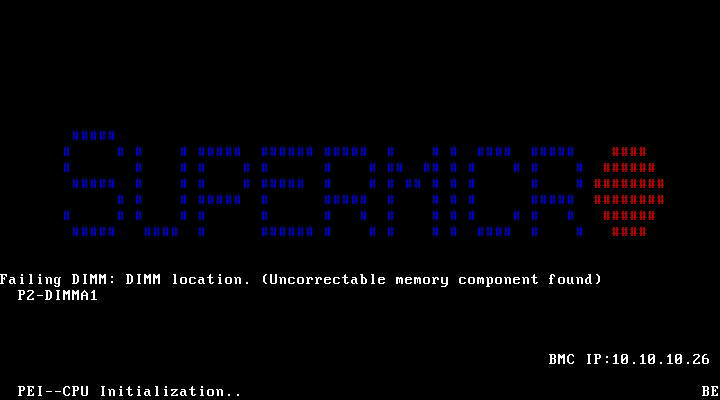

# 6号機 反復2: DIMM P2-DIMMA1 故障によるカーネル起動不能

**日時**: 2026-04-07 04:13 JST
**対象**: 6号機 (ayase-web-service-6, BMC: 10.10.10.26, IP: 10.10.10.206)
**Issue**: #41

## 概要

6号機の OS セットアップ反復2 を試みたが、DIMM P2-DIMMA1 の uncorrectable memory エラーにより
EFI カーネルの展開に失敗し、インストーラの起動が不可能であった。4回の起動試行すべてで同一エラーが発生。
物理的な DIMM 交換/除去が必要。

## 前提条件

- 反復1は完了済み（ただし install-monitor が 182分と異常に長い）
- 反復2開始時、サーバは BIOS Setup 画面で停止していた
- インストール済み OS の GRUB は破損（`grub>` プロンプトに落ちる）

## 発見事項

### 1. EFI カーネル展開エラー（致命的）

UEFI CD ブートで Debian インストーラの GRUB メニュー表示後、カーネルロード時に以下のエラー:

```
Booting 'Automated Install'
Loading kernel...
Loading initrd...
Booting...
EFI stub: ERROR: Failed to decompress kernel
EFI stub: ERROR: efi_stub_entry() failed!
error: start_image() returned 0x8000000000000001.
Failed to boot both default and fallback entries.
```



### 2. DIMM P2-DIMMA1 エラー（POST 画面）

POST 中に以下のメッセージが表示される:
```
Failing DIMM: DIMM location. (Uncorrectable memory component found)
P2-DIMMA1
```



BIOS は故障 DIMM を無効化し、Total Memory = 16384 MB (P1-DIMMA1 の 1枚のみ)。

### 3. 反復1の 182分 install-monitor の根本原因

反復1で install-monitor が 182分かかった原因は、同じ DIMM エラーによるもの:
- カーネル展開が確率的に失敗し、多数のリトライが発生
- たまたま成功してもメモリ破損によりファイルシステムが汚染
- 結果として GRUB 設定が破損し、インストール済み OS も起動不能に

### 4. ISO は原因ではない

| テスト | 結果 |
|-------|------|
| 修正版 ISO (799MB, initrd preseed 注入) | 同一エラー |
| オリジナル ISO (762MB, cdrom preseed) | 同一エラー |
| 同 ISO を他サーバ (4号機, 5号機) で使用 | 正常動作 |

## 必要なアクション

**物理介入が必要**:
1. DIMM P2-DIMMA1 の除去または交換
2. DIMM が未実装の場合、CPU2 メモリコントローラの故障の可能性
3. BIOS の Chipset Configuration > North Bridge でチャネル無効化を試みる（未検証）

## 試行ログ

| 試行 | 操作 | 結果 |
|------|------|------|
| 1 | BIOS Boot Option #1 = UEFI CD/DVD, F4 save | Failed to decompress kernel |
| 2 | Power cycle, 自動ブート | Failed to decompress kernel |
| 3 | Power cycle, cold boot (30s off) | 黒画面、SSH 不通 |
| 4 | ISO 再ビルド (オリジナルスクリプト), remount, boot | 黒画面、SSH 不通 |

## サーバ状態

- 電源: Off (最終操作で power off)
- Boot Option #1: UEFI CD/DVD (BIOS に保存済み)
- VirtualMedia: debian-preseed-s6.iso マウント中
- Issue #41: blocked (物理 DIMM 交換待ち)

## 添付ファイル

- [反復2 findings](attachment/2026-04-07_041337_server6_iter2_dimm_failure/findings.md)
- [診断レポート (後続エージェント用)](attachment/2026-04-07_041337_server6_iter2_dimm_failure/diagnosis.md)
- [EFI エラースクリーンショット](attachment/2026-04-07_041337_server6_iter2_dimm_failure/efi-decompress-error.png)
- [DIMM エラー POST スクリーンショット](attachment/2026-04-07_041337_server6_iter2_dimm_failure/dimm-error-post.png)
