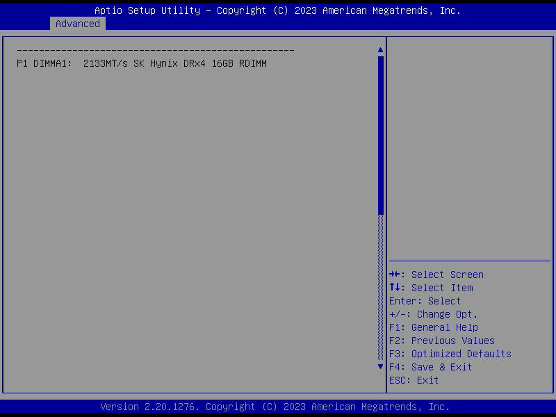
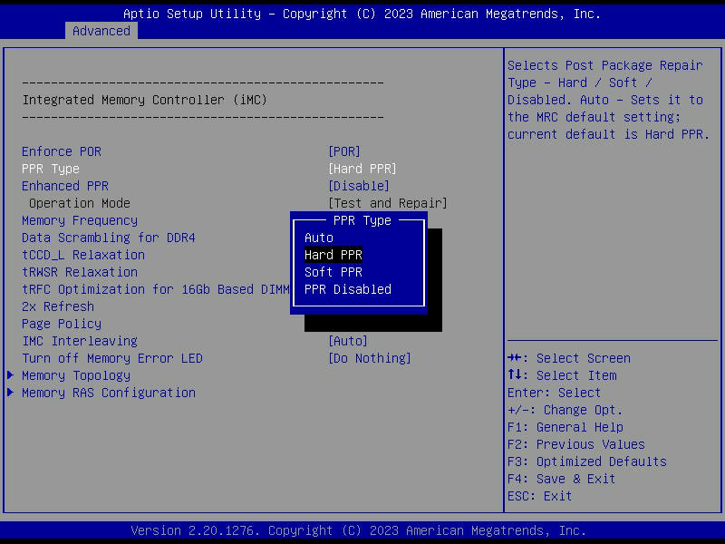
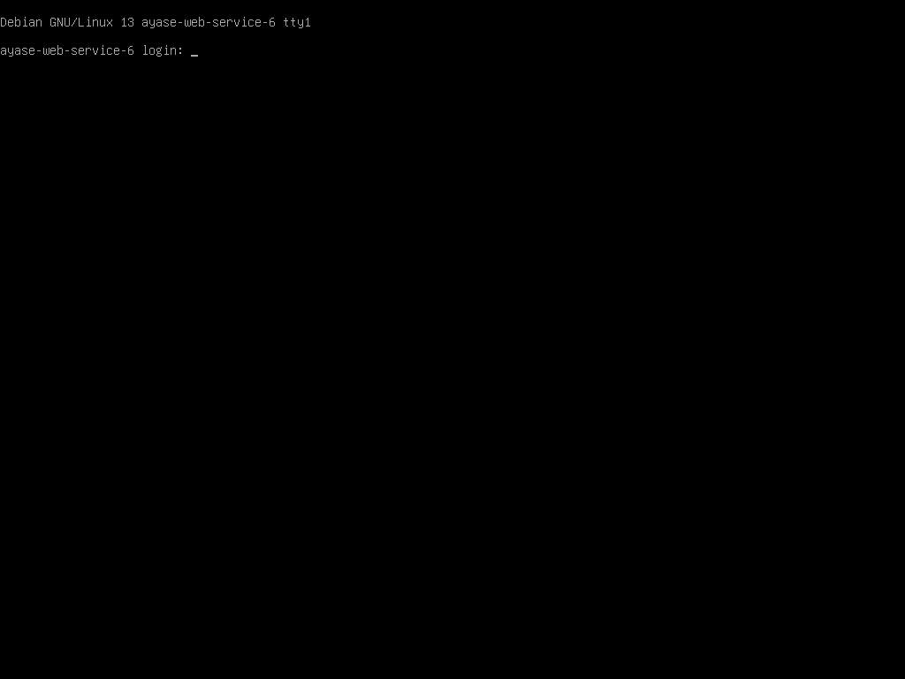
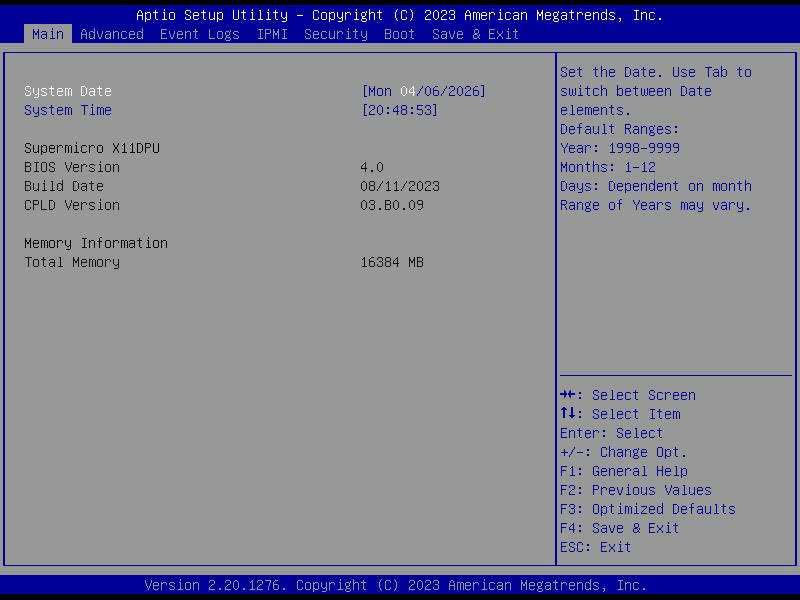
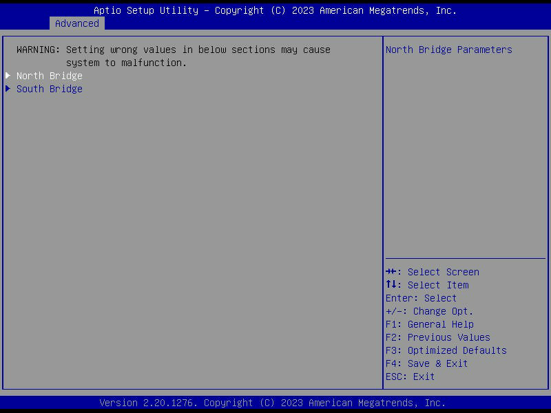
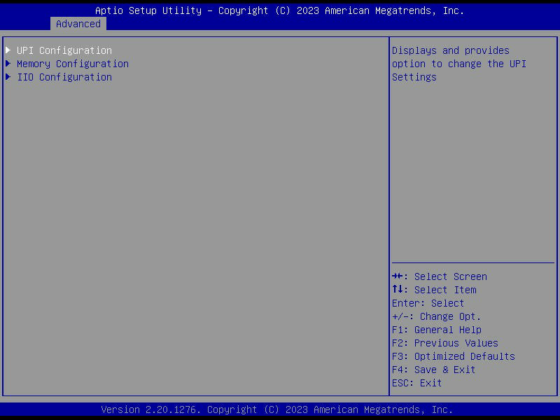
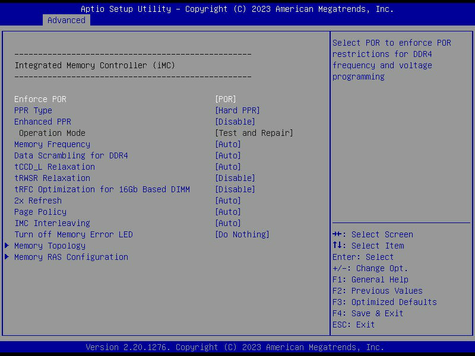

# 6号機 BIOS PPR 設定変更による DIMM エラー対策

**実施日時**: 2026年4月7日 05:38 - 06:23 JST
**対象**: 6号機 (ayase-web-service-6, BMC: 10.10.10.26, IP: 10.10.10.206)
**Issue**: #41

## 前提条件・目的

- 6号機は DIMM P2-DIMMA1 の Uncorrectable Memory エラーにより、EFI カーネル展開が `EFI stub: ERROR: Failed to decompress kernel` で失敗していた
- BIOS の Chipset Configuration > North Bridge > Memory Configuration でメモリチャネル無効化設定を探し、DIMM エラーを回避する方法を調査
- 参照レポート: [6号機 反復2: DIMM P2-DIMMA1 故障によるカーネル起動不能](2026-04-07_041337_server6_iter2_dimm_failure.md)

## 環境情報

| 項目 | 値 |
|------|-----|
| サーバ | 6号機 (ayase-web-service-6) |
| マザーボード | Supermicro X11DPU |
| BIOS | AMI Aptio V2.20.1276, Copyright (C) 2023 |
| BMC IP | 10.10.10.26 |
| 静的 IP | 10.10.10.206 |
| DIMM 構成 | P1-DIMMA1: SK Hynix DRx4 16GB RDIMM 2133MT/s (正常), P2-DIMMA1: 故障 (BIOS が自動除外) |
| 利用可能メモリ | 15Gi (16GB DIMM 1枚) |

## 調査結果

### BIOS メモリチャネル無効化設定

**結論: Supermicro X11DPU BIOS にはメモリチャネルの個別無効化設定は存在しない。**

Advanced > Chipset Configuration > North Bridge > Memory Configuration のすべての項目を確認した。
BIOS の MRC (Memory Reference Code) が自動的に故障 DIMM を検出・除外する仕様であり、
ユーザが手動でチャネルを無効化するオプションは提供されていない。

### Memory Configuration 設定項目

| 項目 | 現在値 | 説明 |
|------|--------|------|
| Enforce POR | POR | Intel POR メモリ仕様の準拠 |
| PPR Type | **Hard PPR (変更済み)** | Post Package Repair |
| Memory Frequency | Auto | メモリ動作周波数 |
| Data Scrambling | Auto | データスクランブリング |
| DIMM allocation for USB based DIMM | Auto | USB DIMM 割当 |
| Page Policy | Auto | メモリページポリシー |
| IMC Interleaving | Auto | IMC インターリーブ |
| Memory LED Configuration | - | メモリエラー LED |
| Memory Topology | (情報のみ) | DIMM スロット情報 |
| Memory RAS Configuration | (サブメニュー) | RAS 信頼性設定 |

### Memory Topology 確認結果

- **P1 DIMMA1**: 2133MT/s SK Hynix DRx4 16GB RDIMM (正常動作中)
- **P2 DIMMA1**: 表示なし (BIOS が故障として除外済み)
- その他 22 スロット: 空



### Memory RAS Configuration 確認結果

| 項目 | 値 |
|------|-----|
| Failing DIMM(s) Lockstep Mode | Disabled |
| Memory Rank Sparing | Disabled |
| Correctable Error Threshold | (default) |
| SDDC | Disabled |
| Patrol Scrub | Enabled |

## 実施した変更

| 設定 | 変更前 | 変更後 | 理由 |
|------|--------|--------|------|
| PPR Type | Disabled | **Hard PPR** | 故障メモリ行を永続的にスペア行にリマップし、uncorrectable error を軽減 |

PPR (Post Package Repair) は DDR4 DRAM の機能で、故障したメモリ行 (row) を DRAM チップ内蔵の
スペア行にリマップする。Hard PPR は恒久的なリマップで、電源を切っても維持される。



## 結果

### 起動テスト: 成功

F4 (Save & Exit) で BIOS 設定を保存後、サーバが正常に POST を完了し OS が起動した。



| 確認項目 | 結果 |
|---------|------|
| POST | 正常完了 (DIMM エラーメッセージの有無は未確認 - POST 画面を撮り逃がし) |
| OS 起動 | Debian GNU/Linux 13.4 (trixie) ログインプロンプト表示 |
| カーネル | 6.12.74+deb13+1-amd64 (Debian 標準カーネル) |
| SSH | 10.10.10.206 でアクセス可能 |
| メモリ | 15Gi total, エラーなし |
| dmesg | "Memory slots populated: 1/24", メモリエラーなし |

### 重要な注意

- 起動したのは**以前のインストール反復で残っていた Debian 13** (PVE カーネルなし)
- PVE カーネル (6.17.13-2-pve) はインストールされていない
- 前回の EFI カーネル展開エラーは、PVE カーネルを含むインストーラのブートで発生
- PPR が根本原因を解決したかは、**新規 OS インストール (PVE カーネル付き) で要確認**

## 再現手順

```sh
# 1. 電源投入
./pve-lock.sh wait ./oplog.sh ipmitool -I lanplus -H 10.10.10.26 -U claude -P Claude123 chassis power on

# 2. Delete 連打で BIOS Setup 入室 (sleep + 120回 Delete を1秒間隔)
sh tmp/db5fe630/enter_bios_s6_v2.sh

# 3. BIOS ナビゲーション
# Advanced (ArrowLeft from Event Logs)
# > Chipset Configuration (ArrowDown x2, Enter)
# > North Bridge (Enter)
# > Memory Configuration (ArrowDown, Enter)
# > PPR Type (ArrowDown from Enforce POR, Enter)
# > Hard PPR を選択 (ArrowDown, Enter)

# 4. F4 で Save & Exit、Yes を選択
```

## BIOS ナビゲーション画面

| パス | スクリーンショット |
|------|------------------|
| BIOS Main タブ |  |
| Chipset Configuration |  |
| North Bridge |  |
| Memory Configuration |  |

## 次のアクション

1. **OS 新規インストールテスト**: os-setup skill で fresh install を試行し、PVE カーネルの EFI 展開エラーが解消されたか確認
2. **PPR 効果が不十分な場合**: Hard PPR は限られた数の行しか修復できない。広範な DIMM 故障の場合は物理交換が必要
3. **追加 BIOS 調整候補**: Enforce POR を Override に変更 (メモリ仕様チェックを緩和)

## 添付ファイル

- [BIOS Main タブ](attachment/2026-04-07_062342_server6_bios_ppr_dimm_fix/bios-main-tab.png)
- [Chipset Configuration](attachment/2026-04-07_062342_server6_bios_ppr_dimm_fix/chipset-config.png)
- [North Bridge](attachment/2026-04-07_062342_server6_bios_ppr_dimm_fix/north-bridge.png)
- [Memory Configuration](attachment/2026-04-07_062342_server6_bios_ppr_dimm_fix/memory-config.png)
- [Memory Topology](attachment/2026-04-07_062342_server6_bios_ppr_dimm_fix/memory-topology.png)
- [PPR Type ダイアログ](attachment/2026-04-07_062342_server6_bios_ppr_dimm_fix/ppr-type-dialog.png)
- [OS 起動成功](attachment/2026-04-07_062342_server6_bios_ppr_dimm_fix/os-boot-success.png)
