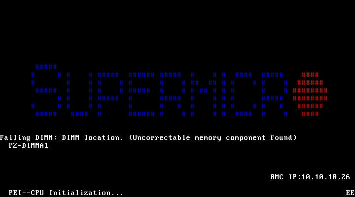

# 6号機 PPR修復後 OS新規インストール結果

- **実施日時**: 2026年4月7日 14:14 - 15:42 JST
- **対象**: 6号機 (ayase-web-service-6, 10.10.10.206)
- **Issue**: #41 (6号機: DIMM P2-DIMMA1 Uncorrectable memory エラー + BootOrder 破損でブート不能)

## 目的

PPR (Post Package Repair) 設定後の6号機に Debian 13 + Proxmox VE 9 を新規インストールし、PVE カーネル (6.17.13-2-pve) が正常に動作するか検証する。以前のエージェントが PPR Type = Hard PPR を設定し、Phase 1-4 (ISO ダウンロード～BMC マウント) まで完了した状態から引き継いだ。

## 前提条件

- PPR Type: Hard PPR 設定済み
- DIMM P2-DIMMA1: Uncorrectable memory component found エラーが POST 中に表示される
- BIOS F3 リセットはしない (PPR 設定が消える可能性)
- Phase 1-3 (iso-download, preseed-generate, iso-remaster) は前エージェントが完了済み

## 結果

**PPR修復成功** -- PVE カーネル 6.17.13-2-pve がエラーなく起動。

### POST 中の DIMM エラー

POST 中に以下のメッセージが表示されるが、POST は正常に通過する:

```
Failing DIMM: DIMM location. (Uncorrectable memory component found)
P2-DIMMA1
```



### POST 所要時間

6号機の POST は DIMM エラー処理のため通常より遅い (約90-120秒)。4号機・5号機の通常 POST (~60秒) と比較して顕著に長い。

### VirtualMedia からの自動ブート

6号機では Redfish BootOptions API が空配列を返すため `find-boot-entry` / `boot-next` が使えないが、BIOS のデフォルト Boot Order で VirtualMedia (ATEN Virtual CDROM) が自動的にブートされた。BIOS Setup に入って Boot Option #1 を変更する必要はなかった。

### OS インストール

Debian インストーラは SOL 経由で約5分で完了:
- LOADING_COMPONENTS -> INSTALLING_BASE -> CONFIGURING_APT -> INSTALLING_SOFTWARE -> INSTALLING_GRUB -> POWER_DOWN

### PVE カーネル起動 (重要検証項目)

PVE カーネル `proxmox-kernel-6.17.13-2-pve-signed` のインストールおよびブートが **`Failed to decompress kernel` エラーなし** で成功した。これが PPR 修復の主要な検証ポイントであり、DIMM の物理修復が有効であることを確認。

## 最終状態

| 項目 | 値 |
|------|-----|
| OS | Debian GNU/Linux 13 (trixie) |
| PVE | pve-manager/9.1.7 |
| カーネル | 6.17.13-2-pve |
| vmbr0 | 10.10.10.206/8 (eno2np1) |
| vmbr1 | 192.168.39.192/24 (eno1np0, DHCP) |
| IPoIB | ibp134s0 192.168.100.3/24 (connected mode, MTU 65520) |
| LINSTOR | linstor-satellite 1.33.1-1 インストール済み |
| Web UI | https://10.10.10.206:8006 応答確認 |

## 所要時間

| Phase | 時間 |
|-------|------|
| Phase 4: bmc-mount-boot | 9m41s |
| Phase 5: install-monitor | 5m55s |
| Phase 6: post-install-config | 9m19s |
| Phase 7: pve-install | 51m33s |
| Phase 8: cleanup | 1m52s |
| **合計 (Phase 4-8)** | **78m20s** |

Phase 1-3 は前エージェントが完了済み。Phase 7 の大部分は PVE パッケージのダウンロードと LINSTOR パッケージのインストール。

## 結論

PPR修復成功。6号機は sonnet でのイテレーション継続可能。DIMM P2-DIMMA1 の Uncorrectable memory エラーメッセージは POST 中に表示され続けるが、OS およびカーネルの動作に影響はない。

## 添付ファイル

- [DIMM Error during POST](attachment/2026-04-07_154248_server6_ppr_os_install/dimm_error_post.png)
