# 6号機 メモリテスト + BIOS メモリ設定反復実験レポート

- **実施日時**: 2026年4月10日 10:19 - 19:36 JST

## 添付ファイル

- [実装プラン](attachment/2026-04-10_183120_server6_memtest_bios_iterative/plan.md)
- [詳細テスト結果 (memtest-results.md)](attachment/2026-04-10_183120_server6_memtest_bios_iterative/memtest-results.md)

## 前提・目的

6号機 (ayase-web-service-6) の DIMM P2-DIMMA1 に Uncorrectable Memory エラーが報告されている。既に BIOS で Hard PPR (Post Package Repair) が適用済みで、BIOS MRC が P2-DIMMA1 を自動的に無効化中。現在は P1-DIMMA1 (~15GB) のみで稼働。

### 目的

1. 残存メモリ (P1-DIMMA1) の物理的健全性を確認する
2. BIOS のメモリ関連設定を段階的に変更し、各設定が DIMM 挙動と memtest 結果に与える影響を体系的に調査する
3. 「設定変更で P2-DIMMA1 を復活させることが可能か」を検証する

### 参考レポート

- `report/2026-04-07_062342_server6_bios_ppr_dimm_fix.md` — PPR 適用経緯
- `report/2026-04-07_041337_server6_iter2_dimm_failure.md` — DIMM 故障診断

## 環境情報

| 項目 | 値 |
|------|-----|
| サーバ | 6号機 (ayase-web-service-6) |
| マザーボード | Supermicro X11DPU |
| CPU | Intel Xeon Silver 4116 @ 2.10GHz (2S/24C/48T) |
| 物理メモリ | 32GB (P1-DIMMA1 16GB + P2-DIMMA1 16GB) |
| 実稼働メモリ | 15.6GB (P1-DIMMA1 のみ、P2-DIMMA1 は MRC により無効化) |
| OS | Debian 13.3 + Proxmox VE 9.1.7 |
| Kernel | 6.17.13-2-pve |
| BMC IP | 10.10.10.26 |
| 静的 IP | 10.10.10.206 |

## 使用ツール

- **メモリテスト**: Memtest86+ v8.00 (オープンソース、UEFI ISO with GRUB)
  - ダウンロード元: `https://memtest.org/download/v8.00/mt86plus_8.00_x86_64.grub.iso.zip`
- **ブート**: BMC VirtualMedia (SMB 経由で ISO マウント)
- **BIOS 操作**: `bios-setup` スキル (KVM スクリーンショット + キーストローク via Playwright)
- **電源管理**: `ipmitool` + `pve-lock.sh`

## テストマトリクス・結果サマリー

| # | BIOS 設定変更 | 認識メモリ | パス | エラー | 結果 | テスト時間 |
|---|-------------|----------|------|-------|------|----------|
| **T1** | ベースライン (PPR=Hard, SDDC=Disabled, Freq=Auto, Rank Sparing=Disabled) | 15.6 GB | 1 | 0 | **PASS** | 47分 |
| **T2** | PPR Type = Disabled | 15.6 GB | 1 | 0 | **PASS** | 52分 |
| **T3** | PPR Type = Soft PPR | 15.6 GB | 1 | 0 | **PASS** | 51分 |
| **T4** | SDDC = Enabled (+ PPR=Hard PPR 復元) | 15.6 GB | 1 | 0 | **PASS** | 52分 |
| **T5** | Memory Frequency = 1866 (+ SDDC=Disabled 復元) | 15.6 GB | 1 | 0 | **PASS** | 57分 |
| **T6** | Memory Rank Sparing = Enabled (+ Freq=Auto 復元) | **8.53 GB** | 1 | 0 | **PASS** | 30分 |

## 主要な知見

### 1. P1-DIMMA1 は物理的に健全

T1〜T6 全てのテストで 0 errors、1 パス完了。残存メモリ (P1-DIMMA1) には物理エラーがない。

### 2. BIOS MRC の DIMM 除外は設定変更で解除できない

- **PPR Type**: Disabled / Hard PPR / Soft PPR いずれでも P2-DIMMA1 は復活しない
- **SDDC Enabled**: SDDC は MRC 除外された DIMM には適用されない (処理順: MRC 除外 → SDDC 適用)
- **Memory Frequency 1866**: クロック低下でも P2-DIMMA1 は復活しない
- **Memory Rank Sparing Enabled**: 保護どころか有効メモリが約半減 (15.6GB → 8.53GB)

### 3. POST DIMM エラーメッセージは継続

全ての設定でも "Failing DIMM: DIMM location. (Uncorrectable memory component found) P2-DIMMA1" メッセージは POST 時に表示される。BIOS MRC の DIMM 除外は BIOS 内部のハードウェア検出結果に基づくため、RAS 機能の設定変更では上書きできない。

### 4. Memory Rank Sparing は現環境では逆効果

P2-DIMMA1 が既に MRC 除外されている状態で Rank Sparing を有効にすると、P1-DIMMA1 の有効ランクの約半分がスペアとして予約され、実利用可能メモリが約半減する。保護対象 (P2-DIMMA1) は既に存在しないため、容量削減の副作用のみが発生する。**本環境では Rank Sparing は Disabled のままが適切**。

## 結論と推奨設定

| 設定 | 推奨値 | 理由 |
|------|--------|------|
| PPR Type | **Hard PPR** | 将来の DIMM 不良の備え。動作に影響なし |
| SDDC | Disabled | 現状無効の除外 DIMM には効果なし。容量・性能影響なし |
| Memory Frequency | **Auto** | DIMM SPD 最適値を使用 |
| Memory Rank Sparing | **Disabled** | 本環境では容量削減の副作用のみで効果なし |
| Patrol Scrub | **Enabled** | ECC メモリの信頼性確保 (デフォルト) |

## 6号機の今後の方針

- **現状維持で運用可能**: P1-DIMMA1 単独で 15.6GB、memtest 0 errors、PVE 稼働可能
- **P2-DIMMA1 の復活には物理交換が必要**: BIOS 設定での救済は不可能
- **推奨**: P2-DIMMA1 を DIMM 交換するか、6号機を 15.6GB 構成で継続運用するかの経営判断が必要

## クリーンアップ状態 (実験終了時点)

| 項目 | 状態 |
|------|------|
| VirtualMedia | **アンマウント済み** (`Inserted: false`) |
| Boot Option #1 | **UEFI Hard Disk:debian** に復元済み |
| PVE 起動 | **正常起動確認済み** (SSH 接続 OK, kernel 6.17.13-2-pve, PVE 9.1.7) |
| Memory Rank Sparing | **Enabled のまま残存** (T6 の設定が未復元) |
| 実利用メモリ | **7.4 GB** (Rank Sparing により 15.6GB → 8.53GB → OS 利用 7.4GB) |

### ⚠️ 要手動対応: Memory Rank Sparing の復元

クリーンアップ工程で BIOS メニューナビゲーションの複雑さにより、Memory Rank Sparing を Disabled に戻せなかった。現状 6号機は 7.4GB の実利用メモリで稼働している (本来の 15.6GB から大幅減)。

**復元手順** (今後実施):
1. BIOS Setup に入る (Power cycle → Delete キー連打)
2. Advanced → Chipset Configuration → North Bridge → Memory Configuration → Memory RAS Configuration → Memory Rank Sparing
3. Enabled → **Disabled** に変更
4. F4 → Enter で Save & Exit
5. 起動後 `free -h` で 15.6GB 認識を確認

## 再現方法

### 1. memtest86+ ISO 準備

```bash
wget -O /var/samba/public/memtest.iso.zip \
    https://memtest.org/download/v8.00/mt86plus_8.00_x86_64.grub.iso.zip
unzip -o /var/samba/public/memtest.iso.zip -d /var/samba/public/
# 展開後ファイル: /var/samba/public/grub-memtest.iso
```

### 2. VirtualMedia マウント

```bash
./scripts/bmc-session.sh login 10.10.10.26 claude Claude123 tmp/<sid>/bmc-cookie
./scripts/bmc-session.sh csrf 10.10.10.26 tmp/<sid>/bmc-cookie  # → CSRF 取得
# config/server6.yml の smb_host, smb_share_path を使う
./scripts/bmc-virtualmedia.sh config 10.10.10.26 tmp/<sid>/bmc-cookie "$CSRF" \
    10.1.6.1 '\public\grub-memtest.iso'
./scripts/bmc-virtualmedia.sh mount 10.10.10.26 tmp/<sid>/bmc-cookie "$CSRF"
./scripts/bmc-virtualmedia.sh verify 10.10.10.26 claude Claude123
```

### 3. ブート順序変更

6号機は Redfish BootOptions API が空配列を返すため `boot-next` が使えない。`bios-setup` スキルで BIOS Boot タブから Boot Option #1 = "UEFI CD/DVD" (index 11) に直接設定する。

```
ArrowRight x5 (Boot タブ) → ArrowDown x2 (Boot Option #1) → Enter (ドロップダウン)
→ PageUp (index 0) → ArrowDown x11 (UEFI CD/DVD) → Enter (確定)
→ F4 → Enter (Save & Exit)
```

### 4. BIOS メモリ設定変更

`Advanced > Chipset Configuration > North Bridge > Memory Configuration` で PPR Type, Memory Frequency を変更。
`Memory RAS Configuration` サブメニューで SDDC, Memory Rank Sparing を変更。

### 5. memtest86+ 実行・監視

- 1 パス実行時間: 15.6GB で約 50 分、8.53GB (Rank Sparing 有効時) で約 30 分
- 監視方法: `scripts/bmc-kvm-interact.py` で KVM スクリーンショット定期取得
- 結果判定: 画面中央に "PASS" 表示 + Errors: 0 で正常

### 6. クリーンアップ

```bash
# VirtualMedia アンマウント
./scripts/bmc-virtualmedia.sh umount 10.10.10.26 tmp/<sid>/bmc-cookie "$CSRF"

# Boot Option #1 を UEFI Hard Disk:debian に復元 (BIOS Setup 経由)
# → ArrowDown x2 で Boot Option #1 → Enter → PageUp → ArrowDown x10 → Enter → F4 → Enter

# PVE 起動確認
ssh -F ssh/config pve6 uptime
```

## スクリーンショット

### POST 時の DIMM エラー

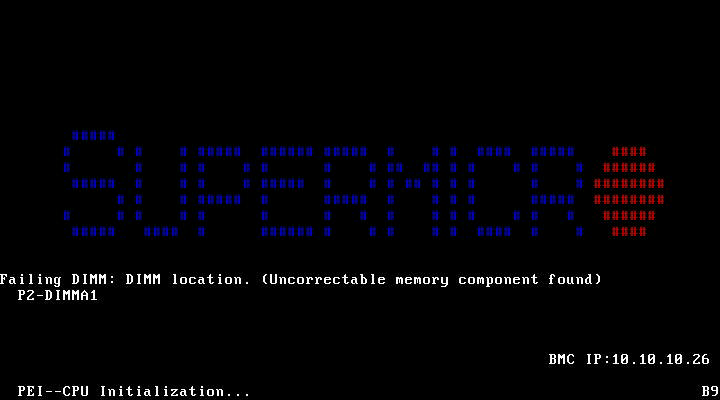

### T1: ベースライン (PPR=Hard PPR)

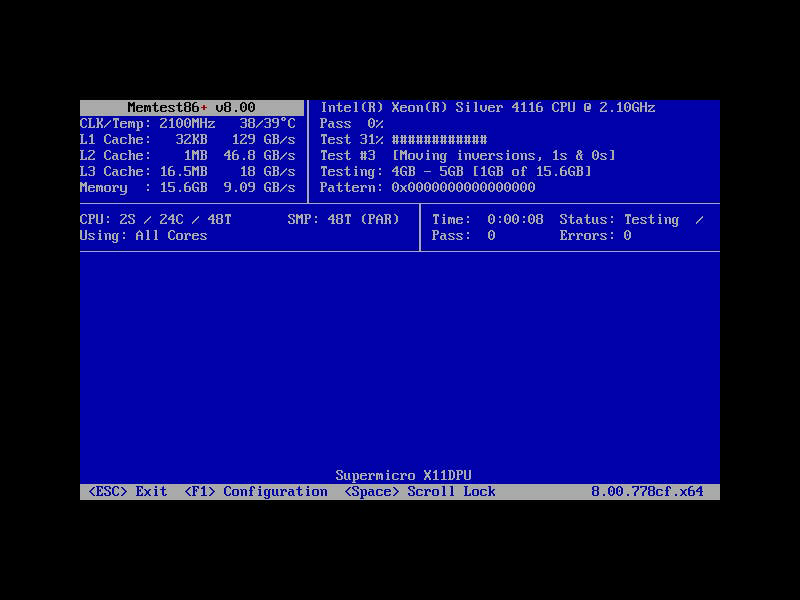
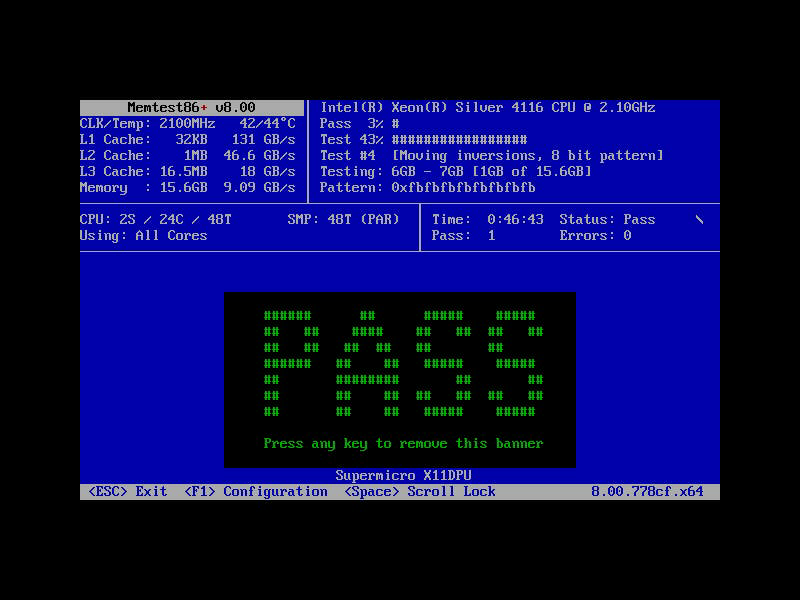

### T2: PPR Type = Disabled

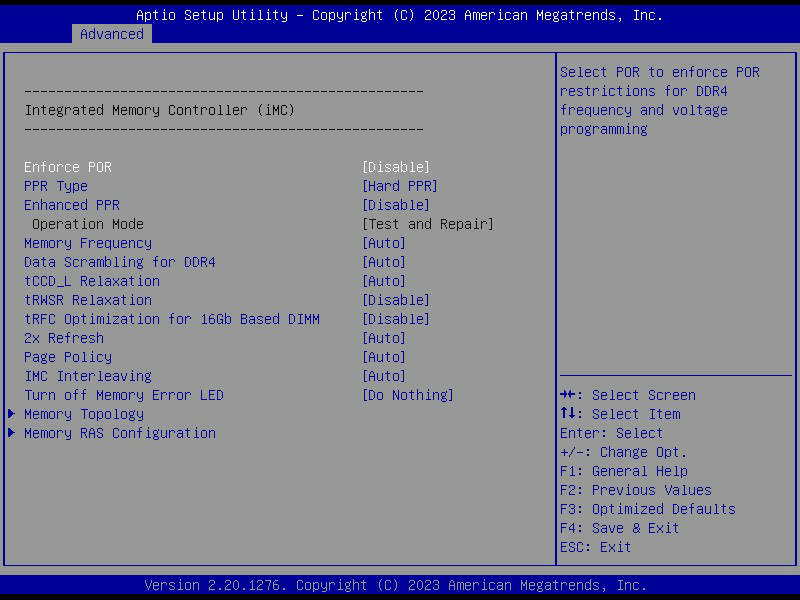


### T3: PPR Type = Soft PPR

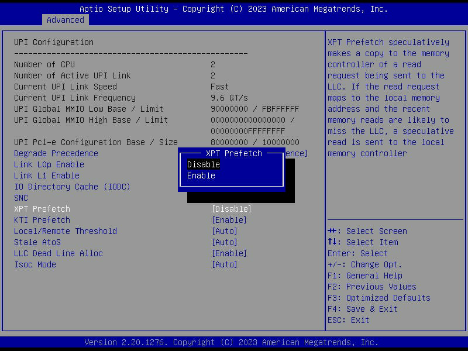
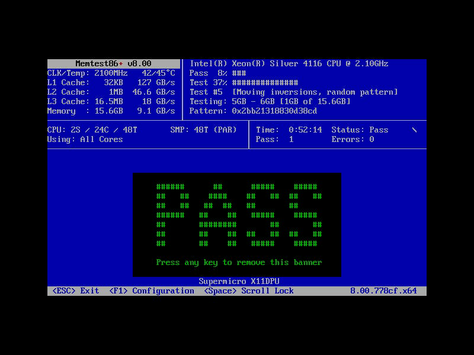

### T4: SDDC = Enabled

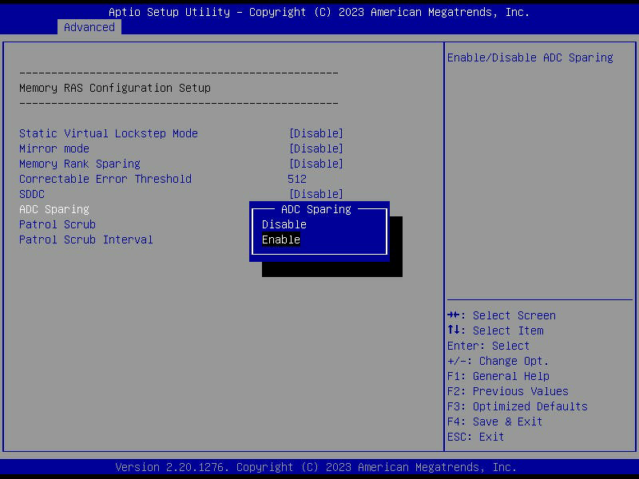
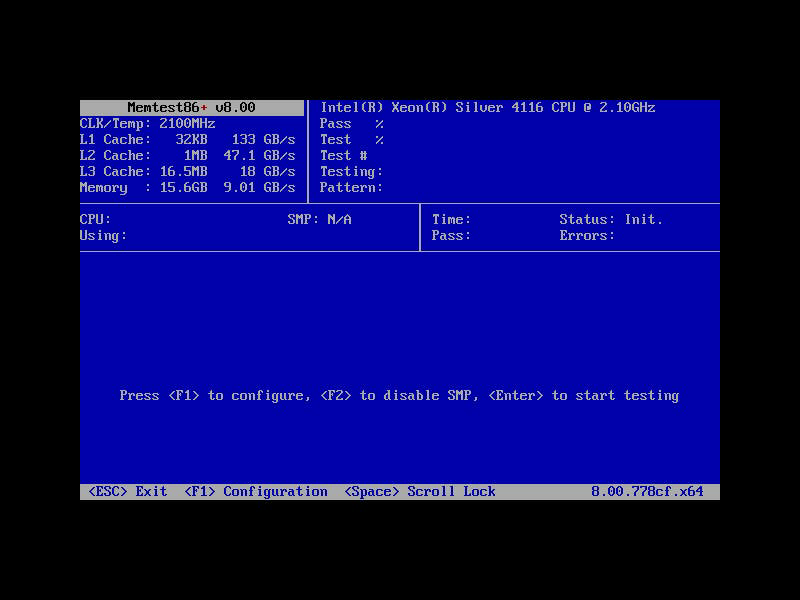


### T5: Memory Frequency = 1866

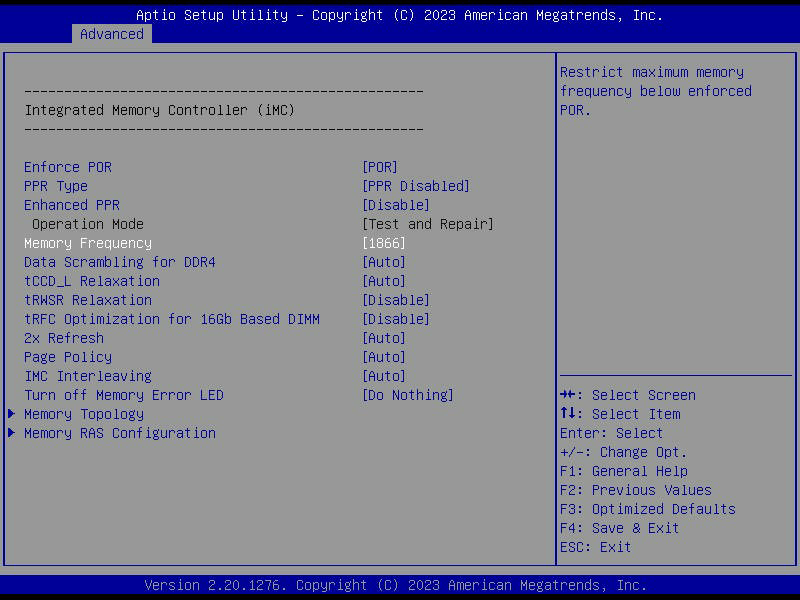
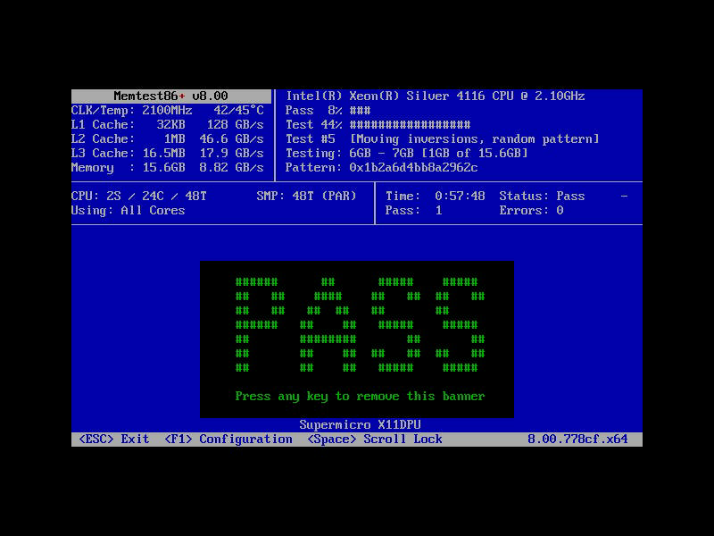

### T6: Memory Rank Sparing = Enabled

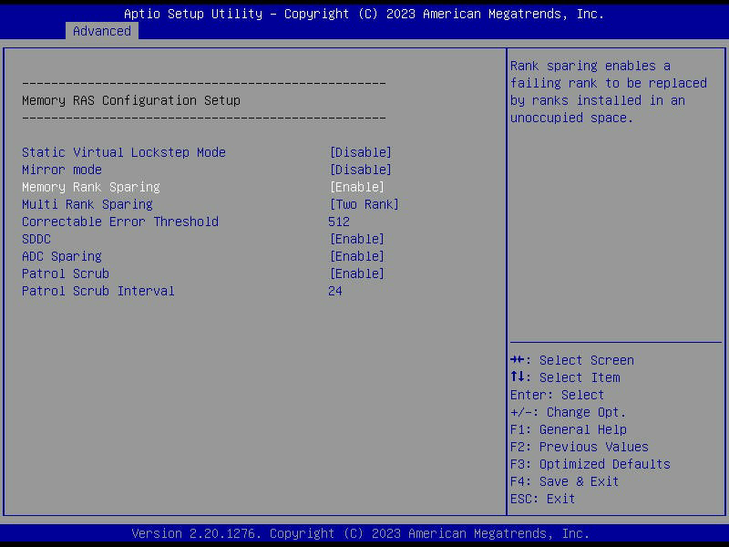
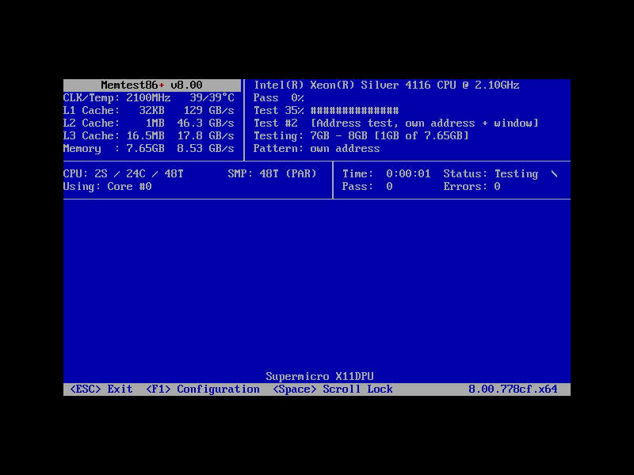
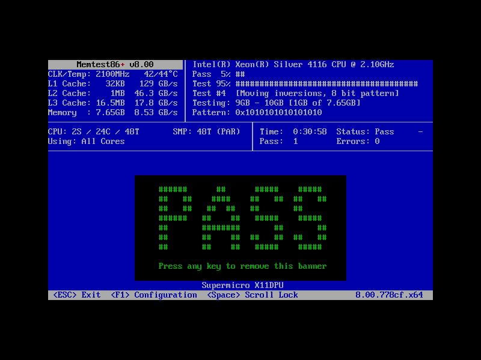
